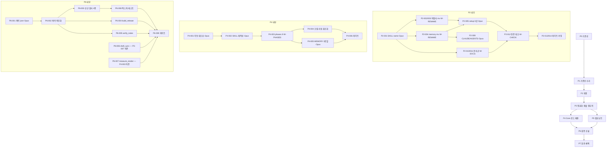

# MASTER EXECUTION PLAN — `/vibecoding-deck` → `/create-slides` 리팩토링

## 1. 문서 메타데이터

| 항목 | 값 |
|---|---|
| Plan ID | `CSR-2026-07` |
| Plan version | `1.0.0` |
| Status | `EXECUTION-READY` |
| Target skill | `/create-slides` |
| Previous skill name | `/vibecoding-deck` |
| Created from | 2026-07-25~26 Fable 5 전면 분석(Sonnet Explore 6기 A~F) + 사용자 결정 8건(DEC-01~08) + 델타 계획 D-1~D-7 |
| Decision lock status | **LOCKED** — 미확정 0건, `PLAN_BLOCKER` 없음 |
| Main model | Opus (`claude-opus-5`) — 유일한 판단·검토·승인 주체 |
| Worker model | Sonnet (`claude-sonnet-5`) — 전 워커 공통 |
| `/하네스` 사용 여부 | **사용하지 않음** (이 문서가 오케스트레이션 규약을 자체 정의한다) |
| `/검토` 사용 여부 | **사용하지 않음** (검증은 §17 매트릭스와 Opus 직접 검토로만 수행한다) |
| Plan modification policy | 실행 중 이 문서를 수정하지 않는다. 계획-저장소 불일치 발견 시 작업을 중단하고 사용자에게 보고한다(§21). 계획 개정은 사용자 승인 후 version을 올려서만 한다 |
| Required branch | `refactor/create-slides` (main에서 분기, P0에서 생성) |
| Merge·push policy | **push·merge는 사용자 명시 승인 전 금지.** 커밋은 Opus만, Phase 검증 게이트 통과 후에만 |

## 2. 실행 요약

- **목적**: 덱 제작 스킬의 규칙 정본을 단일화하고, 필요한 규칙만 필요한 단계에 로드하며, 규칙별 검증을 연결한 `/create-slides` 시스템으로 리팩토링한다. 스킬 이름 변경은 확정 사항이다.
- **현재 구조의 핵심 문제**: ① 같은 규칙이 5~6개 문서에 복제되어 스테일 축적(확진 4건) ② 정본·수치 충돌 6건 ③ 매 세션 강제 로드 약 242KB(16파일) ④ 시각 품질 규칙에 대한 자동 검증 공백(렌더 기반 0건) ⑤ 주차 구조 계약이 1주차 하드코딩 ⑥ 기준선 자체가 깨져 있음(`.claude` 메모리 사본 분기로 `verify_skill_setup.py` 현재 FAIL).
- **목표 상태**: 루트 `SKILL.md`는 Core Contract만(60~80줄), 단계별 규칙은 `references/phases/01~09` 조건부 로드, 디자인 규칙 정본은 `kit/guide/` 4파일에 규칙 ID로 단일화, 주차 계약은 `deck.contract.json` 외부화, 신규 검증 4종+측정 스크립트.
- **실행 전략**: 기준선 수리(P1) → 기계적 개명(P2) → 충돌 해소·접두어 규약(P3) → Core 재작성·로드 재편(P4) → 컴포넌트(P5) → 검증 신설(P6) → 회귀·승인(P7). Opus가 정본 파일을 직접 수정하고, Sonnet 워커 7역할이 소유권이 분리된 파일만 수정한다.
- **가장 위험한 변경**: ① `scripts/verify_skill_setup.py` 하드코딩 8곳(누락 시 검증 전면 FAIL) ② 루트 `SKILL.md` Core화(규칙 유실 위험 — RULE_MIGRATION_MAP 전수 대조로 차단) ③ `verify_deck.py` 계약 외부화(값 오전사 시 회귀 기준 붕괴 — 현행 코드 값 기계 이전·값 변경 금지).
- **전체 Phase 수**: 8 (P0~P7)
- **전체 원자 작업 수**: 56
- **예상 변경량**: 수정 고유 49파일(Phase별 집계를 단순 합산하면 58건 — 동일 파일의 다Phase 수정이 중복 계상되기 때문. 파일 목록 정본은 §12) · 신규 26파일(phases 9·계획 산출물 4[BASELINE_REPORT·EXECUTION_STATE·RULE_MIGRATION_MAP·FINAL_REPORT]·스크립트 3·테스트 1·주차 계약 1·픽스처 8) · 이동(git mv) 5건(스킬 어댑터 디렉터리 2·agent-memory 디렉터리 2·아틀라스 HTML 1)

## 3. 결정 잠금표

| 결정 ID | 주제 | 확정 결정 | 근거가 된 최신 사용자 지시 | 반영되는 Phase | 관련 파일 | 검증 방법 |
|---|---|---|---|---|---|---|
| DEC-01 | 구명 호환 alias | **alias를 두지 않는다.** 문서에 개명 사실 1줄 병기만 | 2026-07-26 "1. a" | P2 | AGENTS.md·skills/README.md | V-02(구명 스텁 디렉터리 부재 확인) |
| DEC-02 | agent-memory 처리 | **디렉터리도 `create-slides`로 개명**하고 `.claude/agent-memory/create-slides/MEMORY.md`는 3줄 포인터 파일로 한다 | 2026-07-26 "2. a" | P1·P2 | `.agents/agent-memory/**`·`.claude/agent-memory/**`·verify_skill_setup.py·CLAUDE.md·AGENTS.md·.agents/README.md | V-01·V-08 |
| DEC-03 | 렌더 검증 자동화 수준 | **`scripts/measure_render.js` + 인앱 브라우저 수동 실행 표준화.** Playwright 등 헤드리스 미도입, requirements-dev 무변경 | 2026-07-26 "3. a" | P6 | scripts/measure_render.js·references/phases/08-검증.md | V-16 |
| DEC-04 | `.s-lead`/`.s-title` 문서-코드 역행 | **코드가 정답.** 문서의 낡은 표기(토큰-치트시트 `.s-title` 44px·`.s-lead` 27px, 디자인시스템 리드 26→27px)를 실측값 `.s-lead` 24px(base)→23px(가독성)·`.s-title` 40px(base)→38px(가독성)로 정정. `kit/styles/*.css` 값 변경 없음 | 2026-07-26 "4. a" | P3 | kit/guide/토큰-치트시트.md(TASK-P3-002)·kit/guide/디자인시스템.md(TASK-P3-003 ④) | V-11 |
| DEC-05 | 초안 파일명 규약 | **`N주차_초안.md` 접두어 공식화.** 검증기는 접두어 우선·무접두어 레거시 폴백(INFO 출력) | 2026-07-26 "5. b" | P3 | scripts/verify_session_docs.py(TASK-P3-007)·문서 8파일군(TASK-P3-006·008) | V-10 |
| DEC-06 | 1주차 처리 | **1주차는 더 이상 손대지 않는다.** `sessions/1주차/**` 전체 동결(수정·추가·삭제·재조립 금지, 읽기와 저장소 밖 복사만 허용). 1주차 계약 파일은 `sessions/_contracts/`에 두고 기존 결함은 `known_violations`로 검출만 한다. 회귀는 저장소 밖 임시 폴더 사본으로만 수행 | 2026-07-26 "6. 1주차는 더이상 손대지 마." | P0·P3·P5·P6·P7 전체 | sessions/_contracts/1주차.deck.contract.json(신설)·verify_deck.py | V-13·V-26(매 Phase `git status`에 `sessions/1주차/` 부재) |
| DEC-07 | 교육원칙 요약의 GIF·녹화 서술 | **"정본은 캡처·짧은 녹화·GIF를 모두 허용하지만, 이 킷이 제공하는 제작 경로는 정적 캡처+주석 스크린샷뿐이다 — 녹화·GIF가 필요하면 사용자 제공 자산으로 취급한다"로 정확 서술** | 2026-07-26 "7. a" | P3 | kit/guide/교육원칙-요약.md | V-07 |
| DEC-08 | D3.js 도입 | **정책(R-D3-01)만 신설.** 벤더 파일(`kit/vendor/d3.min.js`)은 첫 실수요 시 추가 — 이번 실행에서 벤더 파일을 만들지 않는다 | 2026-07-26 "8. a" | P4 | references/phases/05-시각화.md | V-23 |

모든 DEC는 §10의 원자 작업과 §17 검증 매트릭스에 연결되어 있다. 대화에서 답을 찾을 수 없는 항목: 없음. `PLAN_BLOCKER`: 없음.

## 4. 실행 범위

### 포함
- 스킬 개명(`/vibecoding-deck` → `/create-slides`)의 기능·문서 참조 전량(§7.7 인벤토리)
- 기준선 결함 수리(MEMORY-001·002)
- 규칙 충돌 6건 해소(CONFLICT-001~006)·중복 참조화(DUP-001)
- 루트 SKILL.md Core Contract화 + `references/phases/` 9파일 신설(LOAD-001~003)
- MEMORY.md 3분할(MEMORY-003)
- 폰트 스케일 토큰 신설·문서 정정(STRUCT-001, DEC-04)·검정 터미널 kit 승격(STRUCT-002)
- 주차 계약 외부화·신규 검증 4종·신설 스크립트 3종·미니 픽스처(VERIFY-001~006, RESULT-003·004의 검증 계층)
- 초안 파일명 접두어 공식화(CONTRACT-002, DEC-05)

### 제외 (절대 변경 금지)
- **`sessions/1주차/**` 전체** (DEC-06 동결 — 읽기만 허용)
- `sessions/2주차/**` 산출물 전체(초안·자료·실습예제 — 이번 리팩토링의 대상 아님)
- `_dev/설계기록/**` (역사 기록 — 예외: `색시스템-v2-명세.md` 서두 배너 1문단 추가만, TASK-P3-006)
- `GPT_강의설계_보조에이전트/**` (untracked 파생 사본 — P7 최종 보고에 "후속 검토" 항목으로만 기재)
- `kit/fonts/**`·`sessions/1주차/screenshot/**`·이미지 PNG 전량
- `.claude/skills/ui-ux-pro-max/**`·`.agents/skills/ui-ux-pro-max/**`·`skills/하네스/**`·`skills/리서치/**`·`skills/검토/**`의 **규칙 본문**(스킬명 문자열 치환만 허용)
- `outputs/vibecoding-deck-layout-atlas.html`의 **내용**(파일명 rename만 — 내부 title은 다음 아틀라스 재빌드 시 자동 반영, 이번 실행에서 재빌드하지 않는다)
- `sessions/1주차/강의덱_배포.html` 재빌드(기존 보류 지시 유지 + DEC-06)

### 1주차 콘텐츠 결함과의 경계
RESULT-001(PART 라벨 밀림)·RESULT-002(이미지 미배선 3건·고아 4건)·RESULT-004(revision.css 19~21px 8장)·VERIFY-005의 1주차 노트 불일치는 **수정하지 않는다**. `sessions/_contracts/1주차.deck.contract.json`의 `known_violations`에 등재해 1주차 판정을 PASS로 유지하고, 동일 검사가 신규 주차에는 FAIL로 작동하게 한다.

### 후속 작업으로 분리 (이번 실행에서 하지 않음)
- `GPT_강의설계_보조에이전트/` 파생 사본의 규칙 내용 갱신 검토
- D3 벤더 파일 추가(첫 실수요 시)
- 기존 kit CSS 폰트 선언의 `--fs-*` 소급 치환(이번엔 변수 정의만)
- 콘텐츠 스킬(`skills/콘텐츠/SKILL.md`)에 "정의→쉬운 설명→비유" 순서 규칙 추가(CONTENT-001의 상류 해법 — 팀 결정 필요)
- kit/layouts/families/*.md 5파일(vertical-flow·grid-mosaic·top-down·centered·split)의 폰트·밀도 인용(27px·44px·548px) 정정 — P3에서 정본 표 확정 후 별도 작업(이번 범위에 넣으면 밀도 계산 재검토가 필요해 리팩토링 회귀 기준을 흔든다)

## 5. 정본 우선순위

실행 중 정보가 충돌하면 다음 순서를 적용한다.

```text
1. 최신 사용자 확정 결정 (본 문서 §3 결정 잠금표)
2. MASTER_EXECUTION_PLAN.md (이 문서)
3. 해당 Phase의 명시적 원자 작업 (§10)
4. 저장소의 현행 정본 문서 (P3 이후: kit/guide/ 4파일·references/·skills/README.md)
5. 기존 분석 보고서 (2026-07-25 Fable 5 분석 — 이 문서 §7에 요지 수록)
6. (사용 불가) 워커의 판단
```

**워커의 판단은 어떤 경우에도 정본으로 사용할 수 없다.** 워커가 계획과 저장소의 불일치를 발견하면 수정하지 말고 `Deviations from Plan`으로 반환한다. 이 문서와 저장소가 충돌하면 Opus가 §21 중단 조건에 따라 판단한다.

## 6. 권한과 역할 매트릭스

| 역할 | 모델 | 판단 | 파일 수정 | 검토 | 재작업 지시 | Phase 승인 | 커밋 | 사용자 보고 |
|---|---|---:|---:|---:|---:|---:|---:|---:|
| 메인 오케스트레이터 | Opus | 가능 | 가능(정본·공통 파일 전담) | 전담 | 가능 | 전담 | 전담 | 전담 |
| 수정 워커(W-RENAME·W-DOCS·W-GUIDE·W-PHASES·W-KIT·W-VERIFY) | Sonnet | 불가 | 할당 파일만 | 불가 | 불가(지시받은 재작업 수행만) | 불가 | 불가 | 불가 |
| 검증 워커(W-CHECK) | Sonnet | 불가 | 불가 | 객관 결과 수집만 | 불가 | 불가 | 불가 | 불가 |

- 워커는 자신의 작업을 최종 승인하지 않고, 다른 워커를 호출하지 않고, 사용자에게 질문하지 않는다. 모든 정보는 Opus를 경유한다(`Worker A → Opus → Worker B`).
- 워커는 `/하네스`·`/검토`를 포함한 어떤 스킬도 호출하지 않는다.

### 6.1 Worker Result 반환 형식 (모든 워커의 유일한 반환 채널)

```markdown
## Worker Result
- Worker ID:
- Assigned Task ID:
- Status: COMPLETED | BLOCKED | FAILED
- Files Read:
- Files Modified:
- Files Not Modified:
- Commands Run:
- Test Results:
- Objective Output:
- Deviations from Plan:
- Unexpected Findings:
- Remaining Risks:
- Questions for Opus:
```

`Questions for Opus`는 판단 요청이 아니라 계획-저장소 불일치의 기록 전용이다. 워커는 자신의 작업이 최종적으로 올바르다고 선언하지 않는다.

### 6.2 Opus 검토 루프 (모든 원자 작업에 적용)

```text
Opus가 원자 작업 선택 → 파일 소유권·허용 범위 확인(§12) → §14 템플릿으로 정확한 작업 지시
→ 워커 작업 수행 → §6.1 Worker Result 반환 → Opus가 실제 diff 직접 검토(§15 체크리스트)
→ Opus가 검증 결과 직접 검토 → 계획·정본·통과 기준 대조 → 통과 판정 또는 Correction(§16)
```

수정이 필요한 경우: Opus가 실패 원인을 판단해 변경할 파일·위치·목표 상태를 지정하고(§14.2), 워커는 지정된 수정만 수행한다. 워커가 스스로 수정 방향을 설계하게 하지 않는다.

## 7. 전체 시스템 현재 구조 (실행 시 재분석 불필요 — 확정 사실)

### 7.1 파일 구조 (5층)
① 포터블 스킬(루트 `SKILL.md` 180줄 + `kit/`+`references/`+`scripts/`+`입력양식/`+`outputs/`) ② `_dev/설계기록/`(역사) ③ 플랫폼 어댑터(`.claude/skills/vibecoding-deck/SKILL.md` 22줄·`.agents/skills/vibecoding-deck/SKILL.md` 21줄+`agents/openai.yaml` — frontmatter는 루트와 3중 복제, 본문은 "루트를 끝까지 읽어라" 로더) ④ `sessions/`(기준안 630줄·1주차·2주차·`_template/`) ⑤ `skills/`(팀 스킬 정본 + README 계약표).

### 7.2 호출 구조
vibecoding-deck만 자동 발동(description 트리거) + 명시 호출. 체이닝 지목: `skills/콘텐츠/SKILL.md` 7곳·`skills/리서치/SKILL.md` 4곳·`skills/검토/SKILL.md` 3곳·`skills/리서치/references/chunk-schema.md` 1곳(+각 어댑터 6파일). `skills/하네스/**`는 vibecoding-deck 미언급(체이닝 영향 없음).

### 7.3 로드 구조
항상-로드 16파일·약 2,809줄·약 242KB: 엔트리(CLAUDE 2.5KB→@AGENTS 11.3KB·MEMORY 28.8KB·SKILL 37.9KB) + 커리큘럼 정본 29.3KB + read-path ★ 7파일 71.4KB + 카탈로그·역인덱스 4파일 64.4KB. 정본+요약 이중 강제 2계열(커리큘럼 기준안+교육원칙-요약 / 디자인시스템+색시스템-v2-명세+MEMORY). 같은 규칙이 AGENTS·SKILL·MEMORY 3중 명문화.

### 7.4 입력·출력 파이프라인
`/리서치`→자료 5파일→`/콘텐츠`→`N주차_초안.md`(실무 관례·DEC-05로 공식화)→`/vibecoding-deck`→`강의덱.초안/`(shard 정본)→`assemble_deck.py`→`강의덱.html`(생성물)→`build_release.py`→`강의덱_배포.html` + `강의덱_발표자노트.html`→`/검토`.

### 7.5 규칙 정본 현황 (충돌 6건 — P3에서 해소)
- CONFLICT-001: `AGENTS.md`(앵커 `색·폼 정본:`)는 `_dev/설계기록/색시스템-v2-명세.md`를, `SKILL.md`(앵커 `운영 정본은`)·`kit/guide/디자인시스템.md`는 디자인시스템.md를 색 정본으로 지목 — 다수설(디자인시스템.md)로 통일.
- CONFLICT-002: `kit/guide/교육원칙-요약.md`(앵커 `GIF·녹화는 쓰지 않는다`)가 정본 `sessions/바이브코딩_커리큘럼_기준안.md` 원칙 9(앵커 `짧은 녹화 영상, GIF를 활용한다`)와 정반대 — DEC-07 문안으로 재서술.
- CONFLICT-003: 세로예산 상단 오프셋 118(토큰-치트시트, 앵커 `약 548px`) vs 112(MEMORY, 앵커 `top:112px; bottom:54px = 554px`) 병존, 바닥선 규칙 666은 공통(단 일부 기존 레이아웃 코드는 bottom:44로 676px까지 내려가는 결함 관행이 실재 — 규칙이 아닌 사실 기록) — 단일 표로 재작성.
- CONFLICT-004: 차트 코어 개수 — `SKILL.md` "8"이 정답(실측: catalog.html 섹션 D-concentric·D-cycle·D-radial·D-tree·E-code·D-gantt·C-bar·D-mapping = 8), `kit/charts/README.md`(앵커 `catalog.html 6개`)가 스테일.
- CONFLICT-005: 폰트 하한 4변형(22 하한/22–24/center 23/코드·비유 20 예외) 병존 — 예외 포함 단일 표로.
- CONFLICT-006: `SKILL.md` 앵커 `정본은 콘텐츠 스킬 §밀도` — 실존하지 않는 절 이름(실제 `§0-6`).

### 7.6 검증 구조
`verify_deck.py` 1416줄·47검사(정적 파서). 이 중 6검사가 1주차 하드코딩(앵커 `is_week1_student_deck = (` — `parent.name == '1주차'`·stem `{'강의덱','강의덱_배포'}`·`expected_n, expected_dividers = 75, 6`·intro `['S00','S01','S01A','S01B','S01C']`·PART3 ID 순서·터미널 slide `'32'`·THANK YOU). `build_release.py`(앵커 `re.findall(r"<section[^>]*\bpart-divider\b"`)는 `--parts`를 방금 조립한 파일에서 세는 자기참조. 렌더 기반 검사(겹침·666px·computed 폰트)·초안↔덱 diff·노트 정합·강조 분포 검사 없음. 이미지 투명도(`verify_image_assets.py` 픽셀 검사)·배포 자립성(`verify_distributable.py`·fail-closed)은 견고 — 변경하지 않는다.

### 7.7 이름 변경 영향 (122건·49파일)
**기능 참조(P2에서 전량 처리)**: 루트 `SKILL.md:2` frontmatter name / `.claude/skills/vibecoding-deck/`·`.agents/skills/vibecoding-deck/` 디렉터리+frontmatter / `.agents/skills/vibecoding-deck/agents/openai.yaml`(앵커 `$vibecoding-deck`) / `scripts/verify_skill_setup.py` 8곳(앵커: `allowed_targets = {"리서치", "콘텐츠", "검토", "vibecoding-deck", None}` · `canonical_name == "vibecoding-deck"` · `".agents/skills/vibecoding-deck/SKILL.md"` · `".claude/skills/vibecoding-deck/SKILL.md"` · `".agents/skills/vibecoding-deck/agents/openai.yaml"` · `"$vibecoding-deck" in yaml_text` · `".agents/agent-memory/vibecoding-deck/MEMORY.md"` · `".claude/agent-memory/vibecoding-deck/MEMORY.md"`) / `evals/evals.json`(앵커 `"skill_name": "vibecoding-deck"`) / `evals/team-skills-eval.json`(앵커 `"expected_skill": "vibecoding-deck"`) / `outputs/build_layout_atlas.mjs`(앵커 `vibecoding-deck-layout-atlas.html` 2곳) / localStorage 키 3곳(`kit/starter/deck-template.html`·`sessions/_template/강의덱.초안/shell.html` 앵커 `storageKey = 'vibecoding-deck'`, `kit/starter/presenter-notes-template.html` 주석) / 스키마 `$id`·title 2파일(`references/이미지-에셋-manifest.schema.json`·`kit/images/registry.schema.json`).
**문서 참조(P2)**: CLAUDE.md 4곳·AGENTS.md 8곳·README.md 15곳·skills/README.md 6곳·sessions/README.md·sessions/_template/README.md·.claude/skills/README.md 7곳·.agents/README.md 6곳·팀 스킬 정본 3+어댑터 6+chunk-schema·`references/이미지-디렉션-프롬프트.md` 1곳·`kit/guide/디자인시스템.md` 제목·`kit/styles/legibility.css` 주석·`kit/CHANGELOG.md`·`scripts/verify_deck.py` docstring.
**역사 기록(변경 금지)**: `_dev/설계기록/**` 전체·`sessions/1주차/**`(동결)·`sessions/2주차/2주차_PHASE3_인수.md`·`강의덱_배포.html` 내 주석·`.agents/agent-memory/**` 본문 서술(경로는 P2에서 rename, 본문 과거 서술은 유지)·`GPT_강의설계_보조에이전트/`(언급 0건).

### 7.8 기준선 결함 (P0 기록 대상 — 이미 깨져 있는 것)
- `verify_skill_setup.py`의 메모리 바이트 동일성 검사: `.claude/agent-memory/vibecoding-deck/MEMORY.md`(123줄, 커밋 `2833bbe` 이후 정지)와 `.agents/`(159줄, `eb49d2f`까지 갱신)가 분기 → **현재 FAIL 예상**. P0 기준선 리포트에 "기존 결함"으로 기록하고 P1에서 수리.
- `.agents/.../MEMORY.md` 스테일 2건: rgba #23/#30 오탐 항목(코드는 커밋 `8c07f2f`의 `kit_alpha_exempt`로 배포본 한정 해소됨인데 "미해결" 유지) / "편집본 80장·배포본 72장" 계약 기록(현행 코드·실측 모두 75장·divider 6).
- 1주차 실덱 기존 결함(동결 — known_violations 등재 대상): PART divider `P1,P2,P3,P5,P6,P7`(P4 없음)·라벨 밀림 / manifest ready 미배선 슬라이드 `29`·`30`·`S53`, 고아 slide_id `10`·`40`·`41`·`49` / `revision.css`가 `.s-body`를 19~21px로 재하향(S42·S44·S46·S49·S50·S52·S53·S59) / 발표자 노트 pn-no 구버전 의심 / 하단 666px 초과 20장(과거 실측).
- `evals/team-skills-eval.json` 픽스처 설명 스테일(앵커 `1주차_강의덱.html은 폐기됨` 등 — 실제로는 초안·덱 존재).

## 8. 목표 구조

### 8.1 최종 디렉터리 트리 (변경분 주석)
```text
template/
├─ SKILL.md                        # name: create-slides · Core Contract만(60~80줄) · description 불변
├─ kit/guide/
│   ├─ 디자인시스템.md              # 색·강조(R-EMPH-01)·터미널(R-TERM-01) 정본 · 규칙 ID 부여
│   ├─ 토큰-치트시트.md             # 폰트 단일 표(R-TYPE-01·DEC-04 반영)·세로예산 단일화(R-TYPE-03)·--fs-* 스케일 표
│   ├─ 정보모양-taxonomy.md         # 무변경
│   ├─ 카탈로그-규격.md             # family 레지스트리 규칙(R-LAYOUT-03) 승격 수용
│   └─ 교육원칙-요약.md             # 정본 대조 재생성(DEC-07)
├─ references/
│   ├─ phases/01-입력분석.md … 09-배포.md   # ★신설 9파일 — 단계별 조건부 로드
│   ├─ 조립-리듬-불변요소.md        # 중복분 규칙 ID 참조화(고유 내용만 잔류)
│   └─ (이미지 3문서·콘텐츠초안-입력형식.md — 정본 유지, 접두어 문구만 갱신)
├─ kit/styles/deck.css             # :root에 --fs-* 정의 추가(기존 선언 불변)
├─ kit/styles/patterns.css         # .terminal-dark 계열 승격
├─ kit/charts/catalog.html         # 검정 터미널 fragment 1종 추가
├─ scripts/
│   ├─ verify_deck.py              # 주차 계약 3단 탐색 + 신규 검사 4종
│   ├─ verify_notes.py ★ · report_draft_sync.py ★ · measure_render.js ★
│   ├─ verify_session_docs.py      # 초안 접두어 2단 탐색(DEC-05)
│   └─ verify_skill_setup.py       # create-slides 기준 + 포인터 규약 검사
├─ sessions/
│   ├─ _contracts/1주차.deck.contract.json ★  # 1주차 무변경 원칙(DEC-06)의 계약 외부화
│   └─ README.md                   # 1주차 계보 정정·_contracts 규약·접두어 규약
├─ tests/fixtures/mini-week/ ★     # 1주차 과적합 방지 미니 픽스처(§18)
├─ tests/test_deck_contract.py ★
├─ plans/create-slides-refactor/   # 이 계획 + 실행 산출물(BASELINE_REPORT·RULE_MIGRATION_MAP·EXECUTION_STATE·FINAL_REPORT)
├─ .claude/skills/create-slides/SKILL.md      # rename
├─ .agents/skills/create-slides/{SKILL.md, agents/openai.yaml}  # rename
├─ .agents/agent-memory/create-slides/MEMORY.md  # rename · 오답노트만 잔류(3분할)
└─ .claude/agent-memory/create-slides/MEMORY.md  # rename · 3줄 포인터(DEC-02)
```

### 8.2 Core Contract (신 SKILL.md 목차 — TASK-P4-002의 목표 형태)
frontmatter(name: create-slides · description 원문 불변) + ① 입력 계약(`sessions/N주차/N주차_초안.md` 우선·`초안.md` 레거시 폴백·refs 조건부 KB 회수·3진입) ② 출력 계약(shard 정본→생성물→배포본+노트) ③ 정본 우선순위(사용자 지시>초안>커리큘럼 기준안>스킬 판단 / 디자인 정본=`kit/guide/` 4파일) ④ 절대 금지 10항(raw 색·navy·그라데이션 / 민트·코랄 fill 흰 글자(예외 `.hl-mint-mark`) / 흰-온-흰 표면 / 본문 22px 미만(예외는 계약 등재) / 666px 침범 / 초안 임의 재작성 / 아이콘 누출 / 생성물 직접 편집 / `overflow:hidden` 은폐 / 정적 PASS만으로 완료 선언) ⑤ 9단계 게이트 지도(각 1줄+`references/phases/0N` 포인터+통과 조건) ⑥ 필수 검증 게이트(verify_deck+계약·verify_notes·이미지 배선·브라우저 실측·build_release fail-closed) ⑦ 실패 시 중단 조건(계약 파일 부재 WARN 보고·검증 FAIL 지속·소유권 충돌 보고).

### 8.3 Phase Rules / Conditional References
phases 9파일의 소재는 TASK-P4-001의 RULE_MIGRATION_MAP이 규칙 ID 단위로 지정한다. 각 파일 서두에 "이 문서는 N단계에서만 로드한다. 정본 규칙은 규칙 ID로 참조한다" 1줄. `references/이미지-디렉션-프롬프트.md`(283줄)는 정본 유지하되 Core에서는 판정 4상태·게이트 순서 요약만 참조하고 본문은 phases/06에서 진입(LOAD-002).

### 8.4 Components
파트 도입(현행 JS 유지+R-PART-02 검증만 신설) / 검정 터미널(`revision.css`의 `.terminal-dark` 블록을 patterns.css로 승격 — 원본 삭제 금지) / 강조 3종 의미 선택표(R-EMPH-01: 결론 구절=`.hl-mint-mark`·핵심 구=`.hl-mint-underline`·단어=`.hl-mint-text`·구조 연동 주강조=`.hl`(블루) 절제, 슬라이드당 강조 ≤3) / 폰트 스케일 `--fs-14/17/19/22/24/27/32/40/52` 9단계(신규 작성분부터 적용, 기존 선언 불변).

### 8.5 Memory
`.agents/agent-memory/create-slides/MEMORY.md` 잔류=반복 오답→정답·운영 계약·브라우저 검증 판단 요령. 승격=절대 우선순위 1~5(→Core ④)·디자인 판단(→디자인시스템.md ID 참조)·family 레지스트리·노트 재번호 요령(→카탈로그-규격.md·phases/07). 삭제=해소된 rgba 항목·80/72장 기록·1주차 주차 상태(재캡처 5건·배포 보류·666px 20장 목록 — DEC-06 동결로 종결, "1주차 동결(2026-07-26)" 1줄로 대체). 2주차 활성 상태 블록은 유지.

### 8.6 Verification / 어댑터 / 과거 명칭
검증은 §17. 어댑터는 현행 얇은 로더 구조 유지(rename만). 과거 명칭: alias 없음(DEC-01). AGENTS.md에는 정형 문구 1줄("구 명칭 `/vibecoding-deck`은 2026-07에 `/create-slides`로 개명됐다(호환 alias 없음)"), skills/README.md에는 기존 정본 문장 안 괄호 병기("루트 SKILL.md는 create-slides의 정본(역사적 위치·구명 vibecoding-deck)") — 구명 잔존은 이 2건뿐이며 P2-012 허용 목록·V-02와 일치.

### 8.7 D3.js 정책 (R-D3-01 — phases/05 수록, DEC-08)
HTML/CSS 우선(비교·단계·개념도·3~7항목 플로우·단순 막대는 D3 금지). D3 검토 조건: 데이터 포인트 8개 초과 정확 스케일 / 노드 10개 이상 관계·계층 / 데이터 교체 시 자동 재배치 필요. 도입 시 의무: CDN 금지·로컬 벤더링(`kit/vendor/d3.min.js` — 첫 실수요 시 추가)·정적 폴백 필수·`aria-label`·슬라이드당 복잡 시각화 1개·1280×720 고정·렌더 완료 실측 확인.

### 8.8 이미지 정책
정본 `references/이미지-디렉션-프롬프트.md` 유지. 추가 규칙: R-IMG-02(manifest `ready`+필수 판정 자산은 덱에 배선, 고아는 보고 — verify_deck 신규 검사)·R-IMG-03(저정보 슬라이드는 좌설명/우이미지 구성 우선 검토, 빈공간 채우기용 금지 유지 — phases/03).

### 8.9 타이포그래피·강조 시스템
R-TYPE-01 단일 표(본문 22 하한·표 17·코드/비유 20 예외·center 23·`.s-lead` 24→23·`.s-title` 40→38 — DEC-04) / R-TYPE-02(--fs-* 스케일, 신규분) / R-TYPE-03(바닥선 666 불변·신규 top 112/bottom 54=554·기존 코드 118 잔존 주석) / R-EMPH-01 선택표.

## 9. 문제 대응 추적표

처리 분류: `해결`=이번 리팩토링에서 해소 / `검증신설`=검증만 신설(현상 자체는 보존) / `기존결함`=known_violations 기록 / `후속`=후속 작업 / `범위밖` / `보존`=의도적으로 보존.

| 문제/관찰 ID | 실제 원인 | 처리 | 해결 Phase | 원자 작업 ID | 수정 파일 | 검증 ID | 완료 조건 |
|---|---|---|---|---|---|---|---|
| NAME-001 | 기능 참조 16지점 하드코딩 | 해결 | P2 | TASK-P2-001~008 | §12 참조 | V-01·V-02 | verify_skill_setup 전 PASS |
| NAME-002 | 문서 참조 약 60건 | 해결 | P2 | TASK-P2-009~011 | §12 참조 | V-02 | 잔존 grep=제외 목록과 일치 |
| NAME-003 | 부수 하드코딩(atlas·storageKey·$id) | 해결 | P2 | TASK-P2-007·008 | 좌동 | V-02 | 좌동 |
| NAME-004 | 역사 기록 오염 위험 | 보존 | P2 | TASK-P2-012(제외 목록 대조) | 없음(변경 금지) | V-02 | 제외 목록 파일 무변경 |
| DUP-001 | 복제 기반 동기화 | 해결 | P3·P4 | TASK-P3-001·003, P4-002~005 | AGENTS·SKILL·MEMORY·조립-리듬 | V-06 | RULE_MIGRATION_MAP 대조 유실 0·본문 중복 0 |
| CONFLICT-001 | 색 정본 지목 불일치 | 해결 | P3 | TASK-P3-001 | AGENTS.md | V-07 | 지목 단일화 |
| CONFLICT-002 | 요약본이 정본 반대 서술 | 해결 | P3 | TASK-P3-004 | 교육원칙-요약.md | V-07 | DEC-07 문안 반영+대조표 모순 0 |
| CONFLICT-003 | 세로예산 오프셋 병존 | 해결 | P3 | TASK-P3-002 | 토큰-치트시트.md | V-07 | 단일 표 |
| CONFLICT-004 | charts/README 스테일 | 해결 | P3 | TASK-P3-005 | kit/charts/README.md | V-07 | "8" 정정 |
| CONFLICT-005 | 폰트 하한 4변형 | 해결 | P3 | TASK-P3-002 | 토큰-치트시트.md | V-07·V-11 | 예외 포함 단일 표 |
| CONFLICT-006 | 실존하지 않는 절 참조 | 해결 | P4 | TASK-P4-002 | SKILL.md | V-07 | `§0-6` 표기 |
| MEMORY-001 | 사본 분기·검사 FAIL | 해결 | P1 | TASK-P1-001·002 | .claude 메모리·verify_skill_setup.py | V-01 | 포인터 규약 PASS |
| MEMORY-002 | 스테일 2건 | 해결 | P1 | TASK-P1-003 | .agents 메모리 | V-08 | 스테일 문구 잔존 0 |
| MEMORY-003 | 역할 과부하 혼재 | 해결 | P4 | TASK-P4-005 | .agents 메모리 | V-08 | 3분할 완료 |
| LOAD-001 | 로드 전량주의 | 해결 | P4 | TASK-P4-002·003 | SKILL.md·phases/ | V-22 | 항상-로드 바이트 40%+ 감축 |
| LOAD-002 | 이미지 문서 상시 로드 | 해결 | P4 | TASK-P4-003 | phases/06 | V-22 | Core에 요약만 |
| LOAD-003 | 어댑터 중복 목록(판본 재확인 필요) | 해결 | P2 | TASK-P2-002(실행 시 확인 후 있으면 제거) | .claude 어댑터 | V-02 | 중복 목록 부재 |
| CONTRACT-001 | README 1주차 폐기 서술 스테일 | 해결 | P3 | TASK-P3-006 | sessions/README.md | V-09 | 계보 정정 |
| CONTRACT-002 | 초안 파일명 규약 불일치 | 해결 | P3 | TASK-P3-006~008 | verify_session_docs.py+문서 8군 | V-10 | 2주차 접두어 PASS |
| STRUCT-001 | 폰트 토큰 부재·문서-코드 역행 | 해결 | P3·P5 | TASK-P3-002, P5-001 | 치트시트·deck.css | V-11 | --fs-* 정의+문서 실측 일치 |
| STRUCT-002 | 검정 터미널 kit 미승격 | 해결 | P5 | TASK-P5-002 | patterns.css·charts/catalog.html | V-12 | verify_kit PASS |
| VERIFY-001 | 렌더 검사 0 | 검증신설 | P6 | TASK-P6-007 | measure_render.js·phases/08 | V-16 | 스크립트 존재+절차 연결(DEC-03) |
| VERIFY-002 | 1주차 하드코딩 계약 | 해결 | P6 | TASK-P6-001·002 | contract.json·verify_deck.py | V-13 | 1주차 판정 동등+계약 없는 주차 WARN |
| VERIFY-003 | --parts 자기참조 | 해결 | P6 | TASK-P6-004 | build_release.py | V-13 | contract 우선 |
| VERIFY-004 | 초안↔덱 diff 부재 | 검증신설 | P6 | TASK-P6-006 | report_draft_sync.py | V-19 | 리포트 산출 |
| VERIFY-005 | 노트 정합 검증 부재 | 검증신설 | P6 | TASK-P6-005 | verify_notes.py | V-18 | 1주차 불일치 "검출"=성공(기존결함 기록) |
| VERIFY-006 | eval 픽스처 설명 스테일 | 해결 | P3 | TASK-P3-009 | team-skills-eval.json | V-20 | 실상 일치 문안 |
| RESULT-001 | P4 divider 소실·라벨 밀림 | 기존결함+검증신설 | P6 | TASK-P6-001·003 | contract.json·verify_deck.py | V-14 | known_violations 등재·신규 주차 FAIL 작동 |
| RESULT-002 | 이미지 미배선·고아 | 기존결함+검증신설 | P6 | TASK-P6-001·003 | 좌동 | V-15 | 좌동 |
| RESULT-003 | 초안 번호 중복 | 검증신설 | P6 | TASK-P6-006 | verify_session_docs.py | V-19 | 유일성 검사 신규 주차 FAIL 작동 |
| RESULT-004 | 세션 CSS 하한 우회 | 기존결함+검증신설 | P6 | TASK-P6-001·003 | contract.json·verify_deck.py | V-17 | known_violations 등재·린트 작동 |
| CONTENT-001 | 비유-정의 순서는 콘텐츠 계층 | 범위밖(경계만) | P4 | TASK-P4-003(phases/01에 R-OWN-02) | phases/01 | V-06 | 보고 의무 명문화 |
| OBS-01 | 규칙 존재·검증 부재·CSS 장치 미채택 | 검증신설+규칙 통합 | P4·P6 | TASK-P4-003(phases/04)·P6-003 | phases/04·verify_deck.py | V-16·V-21 | br 린트 WARN 작동+수동 게이트 명문화 |
| OBS-02 | 단계 체계 부재(토큰 0건) | 해결 | P3·P5 | TASK-P3-002·P5-001 | 치트시트·deck.css | V-11 | STRUCT-001과 동일 |
| OBS-03 | 선택 기준 부재·컴포넌트 인식 어긋남 | 해결+검증신설 | P3·P6 | TASK-P3-003·P6-003 | 디자인시스템·verify_deck.py | V-21 | R-EMPH-01 표+분포 리포트 |
| OBS-04 | 실물은 등각 큐브·진짜 결함은 정합 미검증 | 검증신설 | P4·P6 | TASK-P4-003(용어 통일)·P6-003 | phases/04·verify_deck.py | V-14 | R-PART-02 검사 작동 |
| OBS-05 | 배선 누락이 주 원인 | 검증신설+규칙 신설 | P4·P6 | TASK-P4-003(phases/03 R-IMG-03)·P6-003 | phases/03·verify_deck.py | V-15 | 배선 검사+우선 검토 규칙 |
| OBS-06 | 노하우 미스크립트화 | 검증신설 | P6 | TASK-P6-007 | measure_render.js | V-16 | VERIFY-001과 동일 |
| OBS-07 | 데이터·관계 시각화 상한 | 해결(정책) | P4 | TASK-P4-003(phases/05 R-D3-01) | phases/05 | V-23 | DEC-08 정책 수록·벤더 부재 |
| OBS-08 | 규칙 부재+컴포넌트 미승격 | 해결 | P3·P5·P6 | TASK-P3-003(R-TERM-01)·P5-002·P6-008(픽스처) | 디자인시스템·patterns.css·fixture | V-12 | kit 승격+MUST 규칙+픽스처 통과 |
| OBS-09 | 규칙 충분·확인 수단 부재 | 규칙 통합+수동 게이트 | P4 | TASK-P4-003(phases/04 R-BOX-01~03) | phases/04·phases/08 | V-21 | 결정표 자기점검 열+게이트 명문화 |
| OBS-10 | 콘텐츠 계층 소관 | 범위밖(경계만) | P4 | TASK-P4-003(phases/01) | phases/01 | V-06 | CONTENT-001과 동일 |

### 규칙 인벤토리 정본 연결표 (R-* 전량)

| 규칙 ID | 정본(목표) | 생성/이동 Phase | 검증 ID |
|---|---|---|---|
| R-COLOR-01~05 | kit/guide/디자인시스템.md | P3(ID 부여)·P4(사본 참조화) | V-06·V-07 |
| R-TYPE-01 | kit/guide/토큰-치트시트.md 단일 표 | P3 | V-11 |
| R-TYPE-02 | 토큰-치트시트.md + deck.css `--fs-*` | P3·P5 | V-11 |
| R-TYPE-03 | 토큰-치트시트.md 세로예산 표 | P3 | V-07 |
| R-TEXT-01·02 | references/phases/04-조립.md | P4 | V-16·V-21 |
| R-BOX-01~03 | references/phases/04-조립.md | P4 | V-21 |
| R-EMPH-01 | kit/guide/디자인시스템.md | P3 | V-21 |
| R-LAYOUT-01·02 | SKILL.md Core ⑤ + phases/02·03 | P4 | V-06 |
| R-LAYOUT-03 | kit/guide/카탈로그-규격.md | P4(MEMORY에서 승격) | V-06 |
| R-PART-01 | SKILL.md Core ⑤(§0-3 승계) + phases/04 | P4 | V-14 |
| R-PART-02 | phases/04 + verify_deck 신규 검사 | P4·P6 | V-14 |
| R-IMG-01 | references/이미지-디렉션-프롬프트.md(유지) | — | V-15 |
| R-IMG-02 | 이미지-디렉션-프롬프트.md 추가 절 + verify_deck | P6 | V-15 |
| R-IMG-03 | phases/03-레이아웃선택.md | P4 | V-15(수동 결정표) |
| R-TERM-01 | kit/guide/디자인시스템.md | P3 | V-12 |
| R-ICON-01 | references/콘텐츠초안-입력형식.md(유지) | — | V-13(verify_deck 실행에 포함되는 기존 검사 #3·#47) |
| R-NOTE-01 | phases/07-발표자노트.md | P4(승격) | V-18 |
| R-OWN-01 | SKILL.md Core ④ | P4 | V-19 |
| R-OWN-02 | SKILL.md Core ④ + phases/01 | P4 | V-19(수동) |
| R-EDU-01 | sessions/바이브코딩_커리큘럼_기준안.md(정본 유지)+교육원칙-요약 재생성 | P3 | V-07 |
| R-VERIFY-01 | phases/08-검증.md(승격)+measure_render.js | P4·P6 | V-16 |
| R-VERIFY-02 | sessions/README.md `_contracts` 규약+verify_deck | P3·P6 | V-13 |
| R-D3-01 | phases/05-시각화.md | P4 | V-23 |
| R-DIST-01 | SKILL.md Core ⑥(기존 9단계 승계) | P4 | V-24(기존 게이트) |
## 10. Phase별 실행 계획

공통 규약 (모든 Phase에 적용):
- Phase 시작 시 Opus가 `git tag refactor-p<N>-start`를 만든다. 커밋·태그는 Opus만 수행한다.
- 모든 워커 지시는 §14의 템플릿을 사용하고, 반환은 §6.1 Worker Result 형식만 허용한다.
- 각 원자 작업은 §6.2 검토 루프(지시→반환→Opus diff 직접 검토→검증 결과 검토→통과/수정)를 거친다. 재작업 한도 2회(§16).
- **모든 Phase 종료 게이트에 동결 검사 포함**: `git status --short` 출력에 `sessions/1주차/` 경로가 존재하면 즉시 중단·보고(V-26).
- 앵커는 문자열 기준이다. 라인 번호는 참고치이며 단독 근거로 쓰지 않는다. 앵커 부재 시 워커는 수정하지 말고 BLOCKED 반환한다.
- "수정 앵커"에 적힌 문자열은 `rg -n "<앵커>"`로 유일 위치를 확인한 뒤 수정한다. 다중 매치면 작업 지시의 파일·절 지정을 따르고, 그래도 모호하면 BLOCKED.
- 파이썬 검증 명령은 실행 전 `$env:PYTHONIOENCODING='utf-8'`(PowerShell)을 설정해 한글 출력 손상을 방지한다. unittest는 P0-002에서 확정한 $PY 인터프리터를 쓴다.

---

### Phase P0: 기준선 고정

#### 목적
현행 상태(검증 PASS/FAIL·1주차 산출물·작업 트리)를 실행 전 기준선으로 기록해, 이후 모든 회귀 판정의 비교 원점을 만든다.
#### 선행 조건
사용자의 실행 착수 승인. 작업 트리에 미커밋 변경이 없거나, 있다면 그 목록을 기준선에 기록.
#### 입력 정본
이 문서 §7.8(기준선 결함 목록).
#### 수정 대상
없음(신규 계획 산출물 4파일 생성만: BASELINE_REPORT.md·EXECUTION_STATE.md — `plans/create-slides-refactor/` 하위).
#### 수정 금지 대상
저장소의 기존 파일 전부.
#### 예상 변경량
Modified: 0 / Created: 2 / Moved: 0 / Deleted: 0
#### 파일 소유권
| 파일 | 소유자 | 병렬 수정 | 검증자 |
|---|---|---|---|
| plans/create-slides-refactor/BASELINE_REPORT.md | Opus | 불가 | Opus |
| plans/create-slides-refactor/EXECUTION_STATE.md | Opus | 불가 | Opus |

#### 원자 작업

#### TASK-P0-001
- 담당: Opus
- 목표: 실행 브랜치와 시작 태그 생성
- 읽을 파일: 없음
- 수정할 파일: 없음(git 메타만)
- 수정 앵커: 해당 없음
- 현재 상태: 브랜치 `main`
- 정확한 변경: `git checkout -b refactor/create-slides` 후 `git tag refactor-p0-start`
- 유지/제거/추가: 해당 없음
- 목표 형태: 현재 브랜치=`refactor/create-slides`, 태그 존재
- 실행 명령: 위 2개 git 명령
- 검증: `git branch --show-current`·`git tag -l refactor-p0-start`
- 객관적 통과 기준: 두 명령 출력이 기대값과 일치
- Opus 검토 기준: main에 커밋이 생기지 않았는가
- 실패 시: 브랜치명 충돌이면 기존 브랜치 상태를 사용자에게 보고 후 중단
- 롤백: `git checkout main` + 브랜치·태그 삭제
- 다음 작업 진입 조건: 통과

#### TASK-P0-002
- 담당: Opus
- 목표: 현행 검증 기준선 기록
- 읽을 파일: 각 명령 출력
- 수정할 파일: plans/create-slides-refactor/BASELINE_REPORT.md (신규)
- 수정 앵커: 해당 없음(신규)
- 현재 상태: 파일 없음
- 정확한 변경: ⓐ 인터프리터 확정 — `.venv\Scripts\python.exe`가 존재하면 그것을, 없으면 전역 `python`을 쓰되 `python -c "import fontTools, PIL"`로 의존성을 먼저 확인한다. 확정 결과를 `$PY`로 BASELINE_REPORT·EXECUTION_STATE에 기록하고 이후 모든 Phase의 unittest 명령에 동일 인터프리터를 쓴다 ⓑ 한글 출력 보전 — 실행 전 `$env:PYTHONIOENCODING='utf-8'`(PowerShell) 설정 ⓒ 다음 5개 명령을 실행하고 전체 출력(PASS/FAIL/WARN 라인)을 파일에 기록 — ① `python scripts/verify_skill_setup.py` ② `python scripts/verify_kit.py` ③ `python scripts/verify_deck.py sessions/1주차/강의덱.html --parts 6` ④ `$PY -m unittest tests.test_deck_pipeline tests.test_image_pipeline` ⑤ `python scripts/verify_session_docs.py 2 --target 초안`(현행 FAIL[`초안.md` 파일 없음]이 기대값 — CONTRACT-002 기존 결함으로 기록)
- 유지: 해당 없음 / 제거: 해당 없음 / 추가: 명령별 결과 절 5개 + "기존 결함" 절(§7.8 목록 대조 결과) + 인터프리터 확정 기록
- 목표 형태: 명령 5개의 원문 출력과 기존 결함 목록·$PY 기록이 담긴 md
- 실행 명령: 사전 단계 ⓐⓑ + 위 5개
- 검증: 파일 존재 + ①에서 메모리 동일성 항목 FAIL이 기록됐는지 확인(§7.8 예상과 일치 — 일치하지 않으면 기준선 결함 목록을 실측으로 갱신해 기록)
- 객관적 통과 기준: 5개 명령 결과가 모두 기록됨
- Opus 검토 기준: §7.8 예상과 실측의 차이가 있으면 그 차이를 BASELINE_REPORT의 "계획과의 차이" 절에 명기했는가
- 실패 시: 명령 자체가 실행 불가(인터프리터 부재 등)면 원인 기록 후 사용자 보고
- 롤백: 파일 삭제
- 다음 작업 진입 조건: 통과

#### TASK-P0-003
- 담당: Opus
- 목표: 1주차 회귀 기준본을 저장소 밖 임시 폴더에 복사(DEC-06 — 저장소 내 1주차 무변경)
- 읽을 파일: sessions/1주차/강의덱.html·강의덱_발표자노트.html·강의덱.초안/ 전체
- 수정할 파일: 없음(저장소 밖 복사만)
- 수정 앵커: 해당 없음
- 현재 상태: 임시 폴더 없음
- 정확한 변경: PowerShell 기준 `$env:TEMP\cs-refactor-regress\`(이하 <REGRESS>) 아래에 `baseline\`(강의덱.html·발표자노트 사본)과 `work\`(강의덱.초안/ 전체 사본 + `kit/` 전체 사본 — CSS 상대경로 `../../kit/...` 유지를 위해 `work\sessions\N주차\강의덱.초안` 구조로 복사)를 만든다
- 유지: 원본 무변경 / 제거: 없음 / 추가: 임시 사본
- 목표 형태: 임시 폴더에서 `python scripts/assemble_deck.py <work의 강의덱.초안>`이 실행 가능한 구조
- 실행 명령: PowerShell `Copy-Item -Recurse`
- 검증: 사본 파일 수·바이트가 원본과 일치(`Get-ChildItem | Measure-Object`)
- 객관적 통과 기준: 강의덱.html 사본 바이트 = 원본 바이트
- Opus 검토 기준: `git status --short`에 sessions/1주차 항목 0건
- 실패 시: 복사 실패 원인 기록·재시도 1회
- 롤백: 임시 폴더 삭제
- 다음 작업 진입 조건: 통과

#### TASK-P0-004
- 담당: Opus
- 목표: 작업 트리 기준선과 실행 상태 파일 생성
- 읽을 파일: `git status --short` 출력
- 수정할 파일: plans/create-slides-refactor/EXECUTION_STATE.md (신규)
- 수정 앵커: 해당 없음(신규)
- 현재 상태: 파일 없음
- 정확한 변경: §20 EXECUTION_STATE 템플릿을 복사해 초기값 기입(Current Phase: P0, git status 기준선 — untracked `GPT_강의설계_보조에이전트/` 포함 — 을 "Existing Known Failures" 아래 "Baseline Worktree" 절로 기록; P0-002의 $PY와 P0-003의 <REGRESS> 경로도 필드로 기록)
- 유지/제거: 해당 없음 / 추가: 상태 파일
- 목표 형태: §20 템플릿 전 필드가 채워진 상태 파일
- 실행 명령: 파일 작성
- 검증: 템플릿 필드 전부 존재
- 객관적 통과 기준: 필드 누락 0
- Opus 검토 기준: 이후 모든 Phase 종료 시 이 파일을 갱신할 것을 확인
- 실패 시: 해당 없음
- 롤백: 파일 삭제
- 다음 작업 진입 조건: 통과 → P0 완료

#### 병렬 실행 그룹
없음(전부 Opus 순차).
#### Phase 검증 게이트
BASELINE_REPORT 4명령 기록 완료 + EXECUTION_STATE 생성 + 동결 검사(V-26).
#### Phase 완료 조건
게이트 통과 후 커밋 `refactor(cs-p0): baseline snapshot`.
#### Phase 중단 조건
기준선 실측이 §7.8과 중대하게 다름(예: verify_deck 1주차 FAIL 항목이 예상 밖으로 존재) → 사용자 보고.
#### Phase 롤백 기준
`git checkout main` → `git branch -D refactor/create-slides` → `git tag -d refactor-p0-start` (plans/ 신규 파일은 브랜치에만 존재하므로 함께 소멸).
#### Phase 완료 보고 형식
"P0 완료 — 기준선: skill_setup [PASS/FAIL 수], kit [..], deck [..], unittest [..] / 기존 결함 n건 기록 / 임시 회귀 폴더 경로".

---

### Phase P1: 기준선 수리 (MEMORY-001·002)

#### 목적
개명 전에 이미 깨져 있는 검증(메모리 사본 분기)과 메모리 스테일 2건을 수리해, P2 이후의 모든 FAIL이 "이번 변경 때문"이 되도록 만든다.
#### 선행 조건
P0 완료.
#### 입력 정본
§3 DEC-02, §7.8.
#### 수정 대상
`.claude/agent-memory/vibecoding-deck/MEMORY.md`·`scripts/verify_skill_setup.py`·`.agents/agent-memory/vibecoding-deck/MEMORY.md`.
#### 수정 금지 대상
그 외 전부(특히 sessions/1주차/**).
#### 예상 변경량
Modified: 3 / Created: 0 / Moved: 0 / Deleted: 0
#### 파일 소유권
| 파일 | 소유자 | 병렬 수정 | 검증자 |
|---|---|---|---|
| .claude/agent-memory/vibecoding-deck/MEMORY.md | Opus | 불가 | Opus |
| scripts/verify_skill_setup.py | Opus | 불가 | Opus |
| .agents/agent-memory/vibecoding-deck/MEMORY.md | Opus | 불가 | Opus |

#### 원자 작업

#### TASK-P1-001
- 담당: Opus
- 목표: `.claude` 메모리 사본을 포인터 파일로 교체(DEC-02)
- 읽을 파일: 대상 파일 현재 내용(교체 전 확인)
- 수정할 파일: .claude/agent-memory/vibecoding-deck/MEMORY.md
- 수정 앵커: 파일 전체 교체
- 현재 상태: 123줄 분기 스테일 사본
- 정확한 변경: 전체 내용을 다음 3줄로 교체 —
  ```
  # MEMORY — 포인터
  정본: ../../../.agents/agent-memory/vibecoding-deck/MEMORY.md
  이 파일에 규칙을 쓰지 않는다.
  ```
- 유지: 없음(전체 교체) / 제거: 기존 123줄 전부 / 추가: 위 3줄
- 목표 형태: 3줄·400바이트 미만·`## ` 헤더 없음(`# ` 제목 1개만)
- 실행 명령: 파일 쓰기
- 검증: `wc -lc` — 3줄, <400B
- 객관적 통과 기준: 좌동 + 정본 경로 문자열 포함
- Opus 검토 기준: 삭제된 내용 중 `.agents` 정본에 없는 고유 정보가 없는가(P0에서 diff 확인 — 분기분은 전부 구버전이므로 없음이 기대값. 있으면 중단·보고)
- 실패 시: 고유 정보 발견 시 중단·사용자 보고
- 롤백: `git checkout refactor-p1-start -- <파일>`
- 다음 작업 진입 조건: 통과

#### TASK-P1-002
- 담당: Opus
- 목표: verify_skill_setup의 메모리 검사를 바이트 동일성→포인터 규약으로 교체
- 읽을 파일: scripts/verify_skill_setup.py
- 수정할 파일: scripts/verify_skill_setup.py
- 수정 앵커: `codex_memory = ROOT / ".agents/agent-memory/vibecoding-deck/MEMORY.md"` 로 시작하는 블록(이하 `read_bytes()` 비교 포함)
- 현재 상태: 두 파일 바이트 동일성 + SHA-256 비교
- 정확한 변경: 검사 로직을 다음으로 교체 — ① `.agents` 경로 파일 존재 ② `.claude` 경로 파일 존재 ③ `.claude` 파일 텍스트에 문자열 `".agents/agent-memory/"` 포함 ④ `.claude` 파일 바이트 < 400 ⑤ `.claude` 파일에 정규식 `^## ` 매치 0건. 다섯 조건 전부 충족 시 PASS
- 유지: 함수 구조·보고 형식·다른 검사 전부 / 제거: 바이트·해시 비교 / 추가: 위 5조건
- 목표 형태: "메모리 포인터 규약" 검사 1항목
- 실행 명령: 편집 후 `python scripts/verify_skill_setup.py`
- 검증: 실행 결과에서 해당 항목 PASS
- 객관적 통과 기준: 전 항목 PASS(P0 기준선에서 FAIL이던 것이 이 항목뿐이어야 함 — BASELINE_REPORT 대조)
- Opus 검토 기준: 다른 검사에 부수 변경이 없는가(diff가 해당 블록에 국한)
- 실패 시: 다른 항목이 새로 FAIL하면 원인 규명 전 진행 금지
- 롤백: 파일 단독 checkout
- 다음 작업 진입 조건: 통과

#### TASK-P1-003
- 담당: Opus
- 목표: `.agents` 정본 메모리의 스테일 2건 정정(MEMORY-002)
- 읽을 파일: .agents/agent-memory/vibecoding-deck/MEMORY.md
- 수정할 파일: 동일
- 수정 앵커 1: `확진된 오탐 1건(2026-07-21)` — 이 불릿 전체를 다음 1문장으로 교체: "rgba kit/덱 검사 기준 불일치는 커밋 `8c07f2f`의 `kit_alpha_exempt`(배포본 한정 kit 유래 rgba 면제)로 해소됐다. 덱이 새로 쓰는 raw 색·rgba는 여전히 FAIL이 정상이다."  이 문장은 미해결 절이 아니라 「브라우저 전수검증」 절 말미로 이동
- 수정 앵커 2: `verify_deck.py 1주차 계약은 **편집본(` — 해당 불릿의 수치 서술을 "편집본·배포본 모두 75장·divider 6(2026-07-24 13차 개정 현행)"으로 교체
- 현재 상태: 두 항목 모두 낡은 사실을 현행처럼 서술
- 정확한 변경: 위 2건만. 다른 항목 무변경
- 유지: 나머지 전부 / 제거: 낡은 수치·미해결 표기 / 추가: 정정 문장
- 목표 형태: `rg "80장|72장|확진된 오탐" <파일>` 매치 0
- 실행 명령: 편집 + 위 rg
- 검증: rg 매치 0
- 객관적 통과 기준: 좌동
- Opus 검토 기준: 정정 외 삭제·추가가 없는가
- 실패 시: 재작업 지시
- 롤백: 파일 단독 checkout
- 다음 작업 진입 조건: 통과

#### TASK-P1-004
- 담당: Opus
- 목표: P1 게이트·커밋
- 실행 명령: `python scripts/verify_skill_setup.py` + `git status --short`
- 객관적 통과 기준: 전 항목 PASS + sessions/1주차 변경 0 + 변경 파일이 소유권 표 3파일뿐
- 커밋: `refactor(cs-p1): repair baseline (memory pointer + stale entries)`
- 롤백: `git reset --hard refactor-p1-start`
- 다음 작업 진입 조건: 통과 → P2
(그 외 필드: 해당 없음)

#### 병렬 실행 그룹
없음.
#### Phase 검증 게이트
TASK-P1-004의 실행 명령·객관적 통과 기준.
#### Phase 완료 조건
TASK-P1-004 통과와 Phase 커밋 완료.
#### Phase 중단 조건
P1-001의 고유 정보 발견 / P1-002에서 신규 FAIL.
#### Phase 롤백 기준
`git reset --hard refactor-p1-start`.
#### Phase 완료 보고 형식
"P1 완료 — verify_skill_setup 전 항목 PASS(기준선 FAIL 1건 해소), 스테일 2건 정정".

---

### Phase P2: 개명 (NAME-001~004, DEC-01·02)

#### 목적
`vibecoding-deck`의 모든 기능·문서 참조를 `create-slides`로 원자적으로 교체한다. 역사 기록은 보존한다.
#### 선행 조건
P1 완료.
#### 입력 정본
§7.7 참조 인벤토리, §3 DEC-01·02.
#### 수정 대상 / 수정 금지 대상
§12 소유권 표의 P2 행 전부 / 그 외 전부. 특히 `_dev/**`·`sessions/1주차/**`·`sessions/2주차/**`·`GPT_강의설계_보조에이전트/**`·`outputs/*.html` 내용(파일명 rename 제외)은 문자열 치환 금지.
#### 예상 변경량
Modified: 약 30 / Created: 0 / Moved: 5(디렉터리 4·파일 1) / Deleted: 0
#### 파일 소유권
| 파일 | 소유자 | 병렬 수정 | 검증자 |
|---|---|---|---|
| SKILL.md·CLAUDE.md·AGENTS.md·scripts/verify_skill_setup.py | Opus | 불가 | Opus |
| .claude/skills/vibecoding-deck→create-slides/(디렉터리 전체)·.agents/skills/vibecoding-deck→create-slides/(디렉터리 전체)·agent-memory 디렉터리 2(mv)·evals 3·outputs/build_layout_atlas.mjs·아틀라스 html·kit/starter 2·sessions/_template/강의덱.초안/shell.html·스키마 2 | W-RENAME | W-DOCS와 파일 겹침 0 조건으로 병렬 가능 | Opus |
| README.md·skills/README.md·sessions/README.md·sessions/_template/README.md·.claude/skills/README.md·.agents/README.md·skills/{리서치,콘텐츠,검토}/SKILL.md·어댑터 6·chunk-schema.md | W-DOCS | W-RENAME과 병렬 가능 | Opus |
| (읽기 전용 잔존 검사) | W-CHECK | — | Opus |

#### 원자 작업

#### TASK-P2-001
- 담당: Opus
- 목표: 루트 SKILL.md frontmatter name 교체
- 수정할 파일: SKILL.md
- 수정 앵커: `name: vibecoding-deck` (2행)
- 현재 상태: 구명
- 정확한 변경: `name: create-slides`로 교체. **description 블록(3~12행)은 1글자도 바꾸지 않는다**(자동 발동 트리거 보존)
- 유지: description·본문 전체 / 제거: 구명 1건 / 추가: 신명
- 목표 형태: frontmatter name만 변경된 diff 1줄
- 검증: `git diff SKILL.md` 가 ±1줄
- 객관적 통과 기준: 좌동
- Opus 검토 기준: description 무변경
- 실패 시/롤백: 파일 checkout
- 다음 작업 진입 조건: 통과(P2-002~008의 선행)

#### TASK-P2-002
- 담당: W-RENAME
- 목표: Claude 어댑터 디렉터리 rename + frontmatter 동기화
- 읽을 파일: .claude/skills/vibecoding-deck/SKILL.md
- 수정할 파일: 동 디렉터리(이동 후 .claude/skills/create-slides/SKILL.md)
- 수정 앵커: `name: vibecoding-deck`
- 정확한 변경: ① `git mv .claude/skills/vibecoding-deck .claude/skills/create-slides` ② SKILL.md frontmatter name을 `create-slides`로(description 불변) ③ 본문에 CLAUDE.md의 "세션 시작 필수 읽기" 목록과 동일한 중복 목록이 존재하면 그 절만 제거(LOAD-003 — 없으면 무변경으로 반환에 명기)
- 유지: 어댑터 본문 절차 6항 / 제거: 구명·(존재 시)중복 목록 / 추가: 신명
- 목표 형태: 신경로에 name=create-slides 어댑터
- 실행 명령: git mv + 편집
- 검증: `test -f .claude/skills/create-slides/SKILL.md` + frontmatter 대조
- 객관적 통과 기준: 신경로 존재·구경로 부재·name 일치
- Opus 검토 기준: 본문 로더 절차가 변형되지 않았는가
- 실패 시: Correction / 롤백: `git mv` 역방향
- 다음 작업 진입 조건: P2-001 통과 후 착수

#### TASK-P2-003
- 담당: W-RENAME
- 목표: Codex 어댑터 rename + openai.yaml
- 수정할 파일: .agents/skills/vibecoding-deck/ → create-slides/ (SKILL.md·agents/openai.yaml)
- 수정 앵커: `name: vibecoding-deck` / `$vibecoding-deck`
- 정확한 변경: git mv + frontmatter name 교체(description 불변) + openai.yaml의 `default_prompt` 내 `$vibecoding-deck`→`$create-slides`, `display_name`·`short_description`에 구명이 있으면 신명으로
- 목표 형태: 신경로 2파일, 구명 문자열 0
- 검증: `rg -c "vibecoding-deck" .agents/skills/create-slides/` = 0
- 객관적 통과 기준: 좌동
- Opus 검토 기준: yaml 구조(키) 무변경
- 롤백: git mv 역방향
- 다음 작업 진입 조건: P2-001 통과

#### TASK-P2-004
- 담당: W-RENAME
- 목표: agent-memory 디렉터리 2곳 rename + 포인터 경로 갱신(DEC-02)
- 수정할 파일: .agents/agent-memory/vibecoding-deck/ → create-slides/, .claude/agent-memory/vibecoding-deck/ → create-slides/, 이동 후 .claude 쪽 포인터 파일 본문
- 수정 앵커: 포인터 2행 `정본: ../../../.agents/agent-memory/vibecoding-deck/MEMORY.md`
- 정확한 변경: git mv 2건 + 포인터 경로를 `.../create-slides/MEMORY.md`로
- 유지: `.agents` 정본 본문 전체(경로만 이동 — 본문 내 과거 서술의 "vibecoding-deck" 문자열은 역사 기록으로 유지)
- 목표 형태: 두 신경로 존재·구경로 부재·포인터가 신경로 지목
- 검증: `test -f` 2건 + 포인터 내용 확인
- 객관적 통과 기준: 좌동
- Opus 검토 기준: `.agents` 정본 본문 diff 0
- 롤백: git mv 역방향
- 다음 작업 진입 조건: P1 완료(포인터 존재)

#### TASK-P2-005
- 담당: Opus
- 목표: verify_skill_setup.py의 이름·경로 리터럴 8곳 교체
- 수정할 파일: scripts/verify_skill_setup.py
- 수정 앵커(전량, 문자열 기준): ① `allowed_targets = {"리서치", "콘텐츠", "검토", "vibecoding-deck", None}` ② `canonical_name == "vibecoding-deck"` ③ `".agents/skills/vibecoding-deck/SKILL.md"` ④ `".claude/skills/vibecoding-deck/SKILL.md"` ⑤ `".agents/skills/vibecoding-deck/agents/openai.yaml"` ⑥ `"$vibecoding-deck" in yaml_text` ⑦ `".agents/agent-memory/vibecoding-deck/MEMORY.md"` ⑧ `".claude/agent-memory/vibecoding-deck/MEMORY.md"`
- 정확한 변경: 8곳 전부 `create-slides` 기준으로
- 목표 형태: `rg -c "vibecoding-deck" scripts/verify_skill_setup.py` = 0
- 검증: 좌동 + `python scripts/verify_skill_setup.py` 전 항목 PASS
- 객관적 통과 기준: 좌동
- Opus 검토 기준: 검사 로직 자체는 무변경(리터럴만)
- 롤백: 파일 checkout
- 다음 작업 진입 조건: P2-002·003·004 완료 후 실행(경로가 실재해야 PASS)

#### TASK-P2-006
- 담당: W-RENAME
- 목표: evals 3파일 이름 값 교체
- 수정할 파일: evals/evals.json·evals/team-skills-eval.json·evals/trigger-eval.json
- 수정 앵커: `"skill_name": "vibecoding-deck"` / `"expected_skill": "vibecoding-deck"` / trigger-eval 내 `vibecoding-deck` 리터럴(있는 경우)
- 정확한 변경: 값만 `create-slides`로. 케이스의 자연어 요청 문구·자연어 어서션 문장 속 서술은 이 작업에서 바꾸지 않는다(단 스킬명을 직접 지목한 어서션 문자열은 교체)
- 목표 형태: 3파일 JSON 유효 + 구명 값 0
- 검증: `python -c "import json;[json.load(open(p,encoding='utf-8')) for p in ['evals/evals.json','evals/team-skills-eval.json','evals/trigger-eval.json']]"`
- 객관적 통과 기준: 파싱 무예외 + `rg -l '"vibecoding-deck"' evals/` 결과 없음
- Opus 검토 기준: 케이스 수·구조 무변경
- 롤백: 파일 checkout
- 다음 작업 진입 조건: 독립(언제든)

#### TASK-P2-007
- 담당: W-RENAME
- 목표: 아틀라스 스크립트·산출 파일명 교체
- 수정할 파일: outputs/build_layout_atlas.mjs + `git mv outputs/vibecoding-deck-layout-atlas.html outputs/create-slides-layout-atlas.html`
- 수정 앵커: `vibecoding-deck-layout-atlas.html` (mjs 내 2곳)
- 정확한 변경: 문자열 2곳 교체 + html 파일 rename. **html 내용은 열지도 수정하지도 않는다**(다음 재빌드 시 자동 반영)
- 목표 형태: mjs가 신파일명을 가리키고 신파일명 존재
- 검증: `rg -c "vibecoding-deck" outputs/build_layout_atlas.mjs` = 0
- 객관적 통과 기준: 좌동 + html diff 0(rename만)
- Opus 검토 기준: `git status`에 html이 rename(R)으로 표시
- 롤백: 역 rename + checkout
- 다음 작업 진입 조건: 독립

#### TASK-P2-008
- 담당: W-RENAME
- 목표: 템플릿 storageKey·주석·스키마 $id 교체
- 수정할 파일: kit/starter/deck-template.html·kit/starter/presenter-notes-template.html·sessions/_template/강의덱.초안/shell.html·references/이미지-에셋-manifest.schema.json·kit/images/registry.schema.json
- 수정 앵커: `storageKey = 'vibecoding-deck'`(deck-template·_template shell) / presenter 주석 `발표자 노트 스타터 — vibecoding-deck` / 스키마 `"$id"`·`"title"` 값의 `vibecoding-deck`
- 정확한 변경: 5파일의 해당 문자열만 `create-slides`로. **`sessions/1주차/강의덱.초안/shell.html`은 대상이 아니다(동결)**
- 목표 형태: 5파일 구명 0
- 검증: `rg -l "vibecoding-deck" kit/starter sessions/_template references/이미지-에셋-manifest.schema.json kit/images/registry.schema.json` 결과 없음
- 객관적 통과 기준: 좌동
- Opus 검토 기준: JS 로직·스키마 구조 무변경(값만)
- 롤백: 파일 checkout
- 다음 작업 진입 조건: 독립

#### TASK-P2-009
- 담당: Opus
- 목표: CLAUDE.md·AGENTS.md의 스킬명·경로·개명 병기
- 수정할 파일: CLAUDE.md·AGENTS.md
- 수정 앵커: CLAUDE.md의 `.claude/skills/vibecoding-deck/SKILL.md`·`/vibecoding-deck`·`.agents/agent-memory/vibecoding-deck/MEMORY.md` / AGENTS.md의 제목 `AGENTS.md — vibecoding-deck 공통 작업 매뉴얼`·본문 `/vibecoding-deck` 전량·agent-memory 경로 전량
- 정확한 변경: 전 참조를 신명·신경로로 + AGENTS.md 서두에 1줄 병기: "구 명칭 `/vibecoding-deck`은 2026-07에 `/create-slides`로 개명됐다(DEC-01: 호환 alias 없음)."
- 목표 형태: 두 파일 구명 잔존은 위 병기 1줄뿐
- 검증: `rg -n "vibecoding-deck" CLAUDE.md AGENTS.md` = 병기 줄 1건
- 객관적 통과 기준: 좌동
- Opus 검토 기준: 규칙 내용 무변경(이름·경로만 — 규칙 개정은 P3·P4에서)
- 롤백: 파일 checkout
- 다음 작업 진입 조건: P2-004 완료(경로 확정 후)

#### TASK-P2-010
- 담당: W-DOCS
- 목표: README 6종 스킬명 교체
- 수정할 파일: README.md·skills/README.md·sessions/README.md·sessions/_template/README.md·.claude/skills/README.md·.agents/README.md
- 수정 앵커: 각 파일의 `vibecoding-deck` 전 매치(README.md 15곳 등)
- 정확한 변경: 전량 `create-slides`로 + skills/README.md의 "루트 `SKILL.md`는 vibecoding-deck의 정본(역사적 위치)" 문장을 "루트 `SKILL.md`는 create-slides의 정본(역사적 위치·구명 vibecoding-deck)"으로 + .agents/README.md의 포인터 서술을 실물과 일치("`.claude/agent-memory/create-slides/MEMORY.md`는 3줄 포인터 파일이다")로
- 목표 형태: 6파일 구명 잔존 = skills/README 병기 1건
- 검증: `rg -c "vibecoding-deck"` 각 파일 — 기대값 목록(README.md 0·skills/README.md 1·나머지 0)과 일치
- 객관적 통과 기준: 좌동
- Opus 검토 기준: 계약표·파이프라인 구조 무변경
- 롤백: 파일 checkout
- 다음 작업 진입 조건: 독립(P2-001 이후)

#### TASK-P2-011
- 담당: W-DOCS
- 목표: 팀 스킬 체이닝 지목 교체
- 수정할 파일: skills/리서치/SKILL.md·skills/콘텐츠/SKILL.md·skills/검토/SKILL.md + .claude/skills/{리서치,콘텐츠,검토}/SKILL.md + .agents/skills/{리서치,콘텐츠,검토}/SKILL.md + skills/리서치/references/chunk-schema.md
- 수정 앵커: 각 파일의 `vibecoding-deck` 전 매치(콘텐츠 정본 7곳 등)
- 정확한 변경: 전량 신명으로. **각 스킬의 규칙 본문·계약 내용은 무변경**(이름 문자열만)
- 목표 형태: 10파일 구명 0
- 검증: `rg -l "vibecoding-deck" skills/ .claude/skills/ .agents/skills/` 결과 없음(단 create-slides 어댑터 자신 제외 확인)
- 객관적 통과 기준: 좌동
- Opus 검토 기준: 치환 외 diff 0
- 롤백: 파일 checkout
- 다음 작업 진입 조건: 독립(P2-001 이후)

#### TASK-P2-012
- 담당: W-CHECK (읽기 전용) → Opus 판정
- 목표: 저장소 전체 잔존 문자열 대조
- 실행 명령: `rg -n "vibecoding-deck" --hidden -g '!.git'`
- 정확한 변경: 없음(수정 금지)
- 객관적 통과 기준(Opus 판정): 잔존 전량이 다음 허용 목록에만 속함 — ① `_dev/설계기록/**` ② `sessions/1주차/**`·`sessions/2주차/**` ③ `GPT_강의설계_보조에이전트/**` ④ `outputs/create-slides-layout-atlas.html` 내용(rename만 했으므로) ⑤ AGENTS.md·skills/README.md 병기 각 1건 ⑥ `.agents/agent-memory/create-slides/MEMORY.md` 본문 과거 서술 ⑦ `kit/CHANGELOG.md`(역사 기록 — 유지) ⑧ `scripts/verify_deck.py` docstring·`kit/guide/디자인시스템.md` 제목·`kit/styles/legibility.css` 주석·`references/이미지-디렉션-프롬프트.md` — **이 ⑧군은 허용이 아니라 누락이다: 발견 시 소유자(각 P3 소유자 또는 W-RENAME)에게 교체 지시**
- Opus 검토 기준: ⑧군 잔존 0이 될 때까지 반복
- 실패 시: 해당 파일 소유자에게 Correction
- 다음 작업 진입 조건: 허용 목록 외 잔존 0

#### TASK-P2-013
- 담당: Opus
- 목표: P2 검증 게이트
- 실행 명령: `python scripts/verify_skill_setup.py` + evals JSON 파싱(P2-006 명령 재실행)
- 객관적 통과 기준: 전 항목 PASS + 파싱 무예외
- 다음 작업 진입 조건: 통과
(그 외 필드: 해당 없음)

#### TASK-P2-014
- 담당: Opus
- 목표: 동결 검사 + 커밋
- 실행 명령: `git status --short` 대조(소유권 표 파일만·sessions/1주차 0건) + `git commit` — `refactor(cs-p2): rename skill to create-slides`
- 롤백: `git reset --hard refactor-p2-start`
- 다음 작업 진입 조건: 통과 → P3
(그 외 필드: 해당 없음)

#### 병렬 실행 그룹
그룹 A(W-RENAME): P2-002·003·004·006·007·008 순차(동일 워커 내). 그룹 B(W-DOCS): P2-010·011. A와 B는 파일 겹침 0이므로 동시 실행 가능(동시 워커 2). Opus 작업(001·005·009)은 명시된 선후에 따름.
#### Phase 검증 게이트
P2-012(잔존 대조)·P2-013(setup PASS)·P2-014(동결·커밋).
#### Phase 완료 조건
게이트 3건 통과.
#### Phase 중단 조건
허용 목록 외 잔존이 Correction 2회 후에도 남음 / setup FAIL 지속.
#### Phase 롤백 기준
`git reset --hard refactor-p2-start` (git mv 포함 전체 원복).
#### Phase 완료 보고 형식
"P2 완료 — 참조 교체 n건, rename 5건, 잔존=허용 목록 일치, setup 전 PASS".

---

### Phase P3: 정본화·충돌 해소·접두어 규약 (CONFLICT-001~005, DUP-001 부분, CONTRACT-001·002, VERIFY-006, DEC-04·05·07)

#### 목적
정본을 파일당 하나로 지목 통일하고, 수치·서술 충돌을 해소하고, 초안 접두어 규약을 코드·문서에 공식화한다.
#### 선행 조건
P2 완료.
#### 입력 정본
§3 DEC-04·05·07, §7.5.
#### 수정 대상 / 수정 금지 대상
§12 P3 행 / 그 외. `sessions/바이브코딩_커리큘럼_기준안.md`(교육 정본)은 **읽기만**(수정 금지 — 정본을 요약본에 맞추지 않는다).
#### 예상 변경량
Modified: 16(P3-001~009 수정 파일 고유 합산) / Created: 0 / Moved: 0 / Deleted: 0
#### 파일 소유권
| 파일 | 소유자 | 병렬 수정 | 검증자 |
|---|---|---|---|
| AGENTS.md·kit/guide/토큰-치트시트.md·kit/guide/디자인시스템.md·sessions/README.md | Opus | 불가 | Opus |
| kit/guide/교육원칙-요약.md·kit/charts/README.md·_dev/설계기록/색시스템-v2-명세.md(배너만) | W-GUIDE | W-DOCS·W-VERIFY와 병렬 가능 | Opus |
| README.md·references/콘텐츠초안-입력형식.md·skills/콘텐츠/SKILL.md+어댑터2·skills/README.md·sessions/_template/콘텐츠_리뷰.html·evals/team-skills-eval.json | W-DOCS | 좌동 | Opus |
| scripts/verify_session_docs.py | W-VERIFY | 좌동 | Opus |

#### 원자 작업

#### TASK-P3-001
- 담당: Opus
- 목표: AGENTS.md 색 정본 지목 통일(CONFLICT-001) + 불변 규칙 참조화(DUP-001 일부) + 초안 접두어 문구(DEC-05)
- 수정할 파일: AGENTS.md
- 수정 앵커: ① `색·폼 정본:` ② `## 불변 규칙` 절 전체 ③ `초안.md`(④층 서술 행)
- 정확한 변경: ① `색·폼 정본: kit/guide/디자인시스템.md(설계 배경: _dev/설계기록/색시스템-v2-명세.md — 역사 기록)`로 교체 ② 불변 규칙 절을 "디자인 불변 규칙 정본은 kit/guide/디자인시스템.md(R-COLOR-01~05·R-EMPH-01·R-TERM-01)와 kit/guide/토큰-치트시트.md(R-TYPE-01~03)다" + 기존 7개 불릿을 각 1줄 요지+규칙 ID로 압축(요지 문구는 기존 문장 재사용, 상세는 정본 참조) ③ `초안.md`→`N주차_초안.md`(레거시 `초안.md` 폴백 병기)
- 유지: 그 외 절 전부 / 제거: 불변 규칙 상세 복제 / 추가: 규칙 ID 참조
- 목표 형태: 불변 규칙 절 ≤10줄, 색 정본 지목 단일화
- 검증: `rg "색시스템-v2-명세" AGENTS.md` — "역사 기록" 문맥 1건만
- 객관적 통과 기준: 좌동
- Opus 검토 기준: 압축 과정에서 7개 불릿의 요지가 전부 남아 있는가(RULE_MIGRATION_MAP은 P4에서 최종 대조하나 여기서 1차 확인)
- 롤백: 파일 checkout
- 다음 작업 진입 조건: P3-003과 같은 정본 체계를 전제하므로 P3-003과 같은 세션에서 Opus가 연속 수행

#### TASK-P3-002
- 담당: Opus
- 목표: 토큰-치트시트 재작성 — 폰트 단일 표(CONFLICT-005·DEC-04)·세로예산 단일화(CONFLICT-003)·--fs-* 스케일 표(R-TYPE-02 문서측)
- 수정할 파일: kit/guide/토큰-치트시트.md
- 수정 앵커: `본문 ≥22px` 문구가 있는 절 / `세로 예산` 절(`약 548px` 포함) / `텍스트·컴포넌트 프리미티브` 절(`.s-title`(800, 44px…)·`.s-lead`(27px) — 이 낡은 44px·27px 표기도 새 표로 흡수·정정) / `아이소 큐브` 표기(95~96행 부근)
- 정확한 변경: ① 폰트 절을 단일 표로 교체 — 행: 본문 .s-body 22(하한)·center 본문 23·리드 .s-lead 23(base 24, legibility 23 — DEC-04 실측)·제목 .s-title 38(base 40)·eyebrow 19·표 ≥17·코드/비유·예시 20(예외: elements-code §·1주차 proc 위계)·주: 예외는 주차 계약(known_allowances)에 등재 ② 세로예산 절을 단일 표로 — 규칙: 바닥선 666px(720−54, 불변)·신규 슬라이드 top 112/bottom 54=가용 554px. 사실 기록(규칙 아님·이번에 수정 금지): 기존 다수 레이아웃은 top 118(가용 548px)이고 일부는 bottom:44로 666을 넘는 676px까지 내려간 결함 관행이 있다 — 신규 작성은 이 관행을 따라가지 않는다 ③ `--fs-*` 스케일 표 추가: `--fs-14/17/19/22/24/27/32/40/52` — "신규 CSS 선언은 스케일 값이면 var(--fs-N)을 쓴다. 스케일 밖 값은 사유 주석 필수"(R-TYPE-02) ④ `아이소 큐브` 표기를 정본 용어 `지오메트릭 큐브`로 교체(P4-003 phases/04 확정 문안과 동일 용어)
- 유지: 색 토큰·행높이 계산식·컨테이너 3종 서술 / 제거: 분산된 폰트 수치 서술·548 단독 서술 / 추가: 표 3개
- 목표 형태: 폰트·세로예산이 각 1개 표로만 존재
- 검증: `rg -c "548" <파일>`(세로예산 표의 사실 기록 행 1건만) + `rg -n "44px|리드 27|(27px)" <파일>` 매치 0 + `rg -n "아이소 큐브" <파일>` 매치 0
- 객관적 통과 기준: 좌동 + 낡은 표기(44px·리드 27px) 잔존 0 + 새 표에 `.s-lead` 24(base)→23(가독성)·`.s-title` 40(base)→38(가독성) 기재 존재
- Opus 검토 기준: 표 값이 §7.5·DEC-04와 일치
- 참고: kit/layouts/families/*.md 5파일의 27px·44px·548px 인용 정정은 이번 범위 밖(§4 후속 작업) — 이 작업에서 건드리지 않는다
- 롤백: 파일 checkout
- 다음 작업 진입 조건: 통과

#### TASK-P3-003
- 담당: Opus
- 목표: 디자인시스템.md — 규칙 ID 부여 + R-EMPH-01 선택표 + R-TERM-01
- 수정할 파일: kit/guide/디자인시스템.md
- 수정 앵커: 기존 색 규칙 각 항목 / 강조 서술 `문맥에 맞게 고른다` / §3 가독성 레이어 표의 `리드` 행(`26px`·`27px`) / `아이소 큐브` 표기(54행 부근) / (신설 절 추가 위치) 문서 말미
- 정확한 변경: ① 기존 규칙 항목에 ID 표기(R-COLOR-01 색 토큰만·02 on-색·03 배지 3종·04 표면·05 색=의미) — 문구는 유지하고 ID만 병기 ② 강조 절을 R-EMPH-01 선택표로 교체: `.hl-mint-mark`=슬라이드의 결론 구절(장당 최대 1)·`.hl-mint-underline`=근거·조건 구절·`.hl-mint-text`=핵심 단어·`.hl`(블루)=구조와 얽힌 주강조(절제)·슬라이드당 강조 합계 ≤3·파트 단위로 세 방식이 모두 0회인 방식이 없도록 자기점검(기계 균등 아님) ③ 말미에 R-TERM-01 절 신설: "프롬프트·AI 요청문·터미널 명령 예시는 터미널 컴포넌트로 표현한다. 표지·밝은 문맥=`.cover-terminal`(흰 표지형), 본문 코드·명령 실행 문맥=`.terminal-dark`(검정형, P5에서 kit 승격). 동일 성격 슬라이드는 같은 변형을 쓴다. 예외(카드 표현)는 결정표에 사유 1줄" ④ §3 가독성 표의 리드 행을 실측값으로 정정(26→24(base)·27→23(가독성))하고 `.s-title` 행(40→38)을 추가(DEC-04) ⑤ `아이소 큐브` 표기를 `지오메트릭 큐브`로 교체
- 유지: 기존 색 문법 전체 / 제거: "문맥에 맞게" 단독 서술 / 추가: ID·선택표·R-TERM-01
- 목표 형태: 규칙 ID가 부여된 정본
- 검증: `rg -c "R-EMPH-01|R-TERM-01|R-COLOR-0" <파일>` ≥ 7 + `rg -n "26px|27px|아이소 큐브" <파일>` 매치 0
- 객관적 통과 기준: 좌동
- Opus 검토 기준: 기존 규칙 문구 유실 0
- 롤백: 파일 checkout
- 다음 작업 진입 조건: 통과

#### TASK-P3-004
- 담당: W-GUIDE
- 목표: 교육원칙-요약 재생성(CONFLICT-002·DEC-07)
- 읽을 파일: sessions/바이브코딩_커리큘럼_기준안.md(정본·수정 금지)·kit/guide/교육원칙-요약.md
- 수정할 파일: kit/guide/교육원칙-요약.md
- 수정 앵커: `GIF·녹화는 쓰지 않는다` + 전 항목
- 정확한 변경: ① 해당 문장을 DEC-07 확정 문안으로 교체: "조작 안내는 사전에 검증한 화면 캡처를 쓴다. 정본(커리큘럼 기준안 §6 원칙 9)은 캡처·짧은 녹화·GIF를 모두 허용하지만, 이 킷이 제공하는 제작 경로는 정적 캡처+주석 스크린샷뿐이다 — 녹화·GIF가 필요하면 사용자 제공 자산으로 취급한다." ② 나머지 전 항목을 정본 원칙 1~10과 문장 단위 대조해, "반대"(같은 대상에 대해 허용↔금지 또는 수치가 뒤집힘) 또는 "정본에 없는 단정"에 해당하면 **수정하지 말고 대조표에 기록만**(수정 여부는 Opus 판단)
- 유지: 정본과 일치하는 항목 전부 / 제거: 반대 서술 1건 / 추가: DEC-07 문안
- 목표 형태: 반대 서술 0 + 대조표(반환물)
- 실행 명령: 편집 + 대조표 작성(Objective Output으로 반환)
- 검증: Opus가 대조표를 정본 원문과 재대조
- 객관적 통과 기준: DEC-07 문안 반영 + 대조표 완비
- Opus 검토 기준: 대조표의 추가 모순 항목에 대해 개별 Correction 여부 판단
- 롤백: 파일 checkout
- 다음 작업 진입 조건: 독립

#### TASK-P3-005
- 담당: W-GUIDE
- 목표: charts/README 정정(CONFLICT-004) + 색시스템v2 배너
- 수정할 파일: kit/charts/README.md·_dev/설계기록/색시스템-v2-명세.md
- 수정 앵커: `catalog.html 6개` / 색시스템v2 문서 첫 줄
- 정확한 변경: ① "6개(...)"를 "8개(D-concentric·D-cycle·D-radial·D-tree·E-code·D-gantt·C-bar·D-mapping)"로 ② 색시스템v2 서두에 1문단 배너 추가: "이 문서는 설계 배경 기록(역사 기록)이다. 실행 규범 정본은 `kit/guide/디자인시스템.md`·`kit/guide/토큰-치트시트.md`다. 본문 중 명령형 서술은 작성 당시 기록으로 남긴다." — **본문은 무변경**
- 목표 형태: README 실측 일치 + 배너 존재
- 검증: `rg "8개" kit/charts/README.md` 1건 / 색시스템v2 첫 20줄에 배너
- 객관적 통과 기준: 좌동
- Opus 검토 기준: _dev 본문 diff가 배너 1문단뿐
- 롤백: 파일 checkout
- 다음 작업 진입 조건: 독립

#### TASK-P3-006
- 담당: Opus
- 목표: sessions/README — 1주차 계보 정정(CONTRACT-001)·`_contracts` 규약·접두어 규약(DEC-05·06)
- 수정할 파일: sessions/README.md
- 수정 앵커: `## 1주차 (예외 — 산출물 폐기됨)` / `초안.md` 전 매치(구조도 11행·cp 예시 26~27행·입출력 규약 31행·집필노트 서술 44행 — 5줄)
- 정확한 변경: ① 1주차 절을 재작성: "구세대 산출물(커밋 2b6371f 이전)은 폐기됐다. 현행 1주차 산출물은 95438ae부터의 신규 계보로 정본이며, **2026-07-26 사용자 결정으로 동결됐다 — 수정·재조립하지 않는다.** 구조 계약은 `sessions/_contracts/1주차.deck.contract.json`" ② `_contracts/` 규약 절 신설: "주차 구조 계약은 원칙적으로 `sessions/N주차/deck.contract.json`. 동결 주차는 `sessions/_contracts/<폴더명>.deck.contract.json`. verify_deck 탐색 순서: 덱과 같은 폴더 → _contracts → 없으면 WARN" ③ 초안 파일명을 `N주차_초안.md`로 교체하고 "레거시 무접두어 `초안.md`는 폴백으로 인식(INFO)" 병기
- 목표 형태: 세 규약이 명문화된 README
- 검증: `rg "_contracts|N주차_초안" sessions/README.md` 각 ≥1
- 객관적 통과 기준: 좌동
- Opus 검토 기준: 기존 규약(shard·배포·이미지 계약) 무변경
- 롤백: 파일 checkout
- 다음 작업 진입 조건: 독립

#### TASK-P3-007
- 담당: W-VERIFY
- 목표: verify_session_docs 접두어 2단 탐색(DEC-05)
- 수정할 파일: scripts/verify_session_docs.py
- 수정 앵커: ① `"초안": ["sessions/*주차/초안.md"` ② `("초안", root / "sessions" / f"{wk}주차" / "초안.md")` ③ `"draft": sess / "초안.md"`
- 정확한 변경: 헬퍼 `resolve_draft(sess_dir, wk)` 신설 — `{wk}주차_초안.md` 존재 시 그것, 아니면 `초안.md` 폴백(폴백 시 `print("INFO: 레거시 무접두어 초안 사용: <경로>")`). 앵커 ②③을 헬퍼 호출로 교체, 앵커 ①의 glob에 `"sessions/*주차/*초안.md"` 패턴 추가(기존 패턴 유지)
- 유지: 검사 로직 전체 / 제거: 없음 / 추가: 헬퍼+INFO
- 목표 형태: 접두어 우선·레거시 폴백
- 실행 명령: `python scripts/verify_session_docs.py 2 --target 초안`
- 검증: 위 명령이 `sessions/2주차/2주차_초안.md`를 인식해 7 PASS/0 FAIL. **주의: 현행 기준선은 FAIL이다**(검증기가 `초안.md` 정확명만 탐색 — P0-002 ⑤에 기존 결함으로 기록됨). 이 작업의 기대 결과는 FAIL→PASS 전환(개선)이다
- 객관적 통과 기준: 좌동 + 1주차 대상 실행 시(읽기만) INFO 폴백 출력
- Opus 검토 기준: 기존 검사 로직 무변경(resolve_draft 헬퍼·경로 해석 외 diff 없음 — 초안이 인식되면서 실행되는 검사 항목 수가 늘어나는 것은 정상)
- 롤백: 파일 checkout
- 다음 작업 진입 조건: 독립

#### TASK-P3-008
- 담당: W-DOCS
- 목표: 접두어 규약 문서군 갱신(DEC-05)
- 수정할 파일: README.md·references/콘텐츠초안-입력형식.md·skills/콘텐츠/SKILL.md·.claude/skills/콘텐츠/SKILL.md·.agents/skills/콘텐츠/SKILL.md·skills/README.md·sessions/_template/콘텐츠_리뷰.html
- 수정 앵커: 각 파일의 `초안.md` 매치(콘텐츠 정본 9곳·리뷰 html 7곳 등) — 단 `N주차_콘텐츠…` 같은 무관 매치 제외, `sessions/N주차/초안.md` 경로 표기와 단독 명사 `초안.md`만
- 정확한 변경: `sessions/N주차/초안.md` → `sessions/N주차/N주차_초안.md` (첫 등장 위치에만 "(레거시 `초안.md` 폴백 인식)" 병기, 파일당 1회)
- 목표 형태: 규약 표기 통일
- 검증: `rg -n "N주차/초안\.md" <7파일>` 매치 0
- 객관적 통과 기준: 좌동
- Opus 검토 기준: 무관 문맥 오치환 0(diff 전수)
- 롤백: 파일 checkout
- 다음 작업 진입 조건: 독립

#### TASK-P3-009
- 담당: W-DOCS
- 목표: team-skills-eval 픽스처 설명 정정(VERIFY-006)
- 수정할 파일: evals/team-skills-eval.json
- 수정 앵커: `초안.md 없음. 덱 없음 — 1주차_강의덱.html은 폐기됨` 및 인접 어서션 2건(`실제로 없는 초안.md·강의덱.html`)
- 정확한 변경: setup·어서션 문안을 현 상태로 교체 — "sessions/1주차 실데이터 그대로(자료 5파일·1주차_초안… 아님: `초안.md`·`강의덱.html`·발표자노트 존재·동결 상태)" + 어서션은 "존재하는 산출물이 검토 대상 인벤토리에 포함됨"으로. JSON 구조·케이스 ID 무변경
- 목표 형태: 픽스처 설명=실상
- 검증: JSON 파싱 + `rg "폐기됨" evals/team-skills-eval.json` 0
- 객관적 통과 기준: 좌동
- Opus 검토 기준: 케이스의 검증 의도(읽기 전용·SKIP 규약)가 보존됐는가
- 롤백: 파일 checkout
- 다음 작업 진입 조건: P2-006 이후(같은 파일을 P2가 먼저 수정 — Phase 경계로 자연 충족)

#### TASK-P3-010
- 담당: Opus
- 목표: P3 게이트·커밋
- 실행 명령: `python scripts/verify_kit.py` + `python scripts/verify_session_docs.py 2 --target 초안` + `python scripts/verify_skill_setup.py` + `rg -n "아이소 큐브" kit/guide/`(매치 0) + `git status --short` 대조
- 객관적 통과 기준: 세 스크립트 결과가 기준선 대비 악화 0(kit PASS·session_docs 7 PASS·setup 전 PASS) + 변경 파일=소유권 표 + sessions/1주차 0건
- 커밋: `refactor(cs-p3): canonicalize rules, resolve conflicts, draft prefix convention`
- 롤백: `git reset --hard refactor-p3-start`
- 다음 작업 진입 조건: 통과 → P4(P5 병렬 시작 가능)
(그 외 필드: 해당 없음)

#### 병렬 실행 그룹
Opus(001→002→003→006 순차) ∥ W-GUIDE(004→005) ∥ W-DOCS(008→009) ∥ W-VERIFY(007) — 동시 워커 3 상한 준수: W-GUIDE·W-DOCS·W-VERIFY 동시 가동 가능(파일 겹침 0).
#### Phase 검증 게이트
TASK-P3-010의 실행 명령·객관적 통과 기준.
#### Phase 완료 조건
TASK-P3-010 통과와 Phase 커밋 완료.
#### Phase 중단 조건
P3-004 대조표에서 정본 자체의 내적 모순 발견(정본 수정이 필요해지는 경우 — 사용자 보고) / 오치환 반복.
#### Phase 롤백 기준
`git reset --hard refactor-p3-start`.
#### Phase 완료 보고 형식
"P3 완료 — 충돌 6건 중 5건 해소(잔여 CONFLICT-006은 P4), 접두어 규약 코드·문서 반영, 2주차 검증 PASS".

---

### Phase P4: Core Contract·로드 재편 (LOAD-001·002, DUP-001, MEMORY-003, CONFLICT-006 — LOAD-003은 P2-002에서 처리)

#### 목적
루트 SKILL.md를 Core Contract로 재작성하고, 단계 규칙을 phases/ 9파일로 이동하며, MEMORY를 3분할한다. **규칙 유실 0**이 최우선 제약이다.
#### 선행 조건
P3 완료(정본 체계 확정).
#### 입력 정본
§8.2·8.3·8.5, §9 규칙 연결표.
#### 수정 대상 / 수정 금지 대상
§12 P4 행 / 그 외. `references/이미지-디렉션-프롬프트.md`·`콘텐츠초안-입력형식.md`·이미지-스크린샷-배포.md는 이 Phase에서 무변경(정본 유지).
#### 예상 변경량
Modified: 4(SKILL.md·조립-리듬-불변요소·MEMORY·카탈로그-규격) / Created: 10(phases 9 + RULE_MIGRATION_MAP) / Moved: 0 / Deleted: 0
#### 파일 소유권
| 파일 | 소유자 | 병렬 수정 | 검증자 |
|---|---|---|---|
| plans/create-slides-refactor/RULE_MIGRATION_MAP.md·SKILL.md·.agents/agent-memory/create-slides/MEMORY.md·kit/guide/카탈로그-규격.md | Opus | 불가 | Opus |
| references/phases/01~09(신설)·references/조립-리듬-불변요소.md | W-PHASES | Opus 완료 후 착수(순차) | Opus |

#### 원자 작업

#### TASK-P4-001
- 담당: Opus
- 목표: 규칙 이동 대조표(RULE_MIGRATION_MAP) 작성
- 읽을 파일: SKILL.md·AGENTS.md·kit/guide/ 4파일·references/ 4파일·.agents/agent-memory/create-slides/MEMORY.md
- 수정할 파일: plans/create-slides-refactor/RULE_MIGRATION_MAP.md (신규)
- 정확한 변경: 표 작성 — 열: 규칙 ID | 원문 위치(파일+앵커 문구) | 처리(Core 잔류/phases-0N 이동/정본 참조화/MEMORY 승격/삭제) | 신위치 | 대조 상태. §9 규칙 연결표의 R-* 전량 + SKILL.md 현행 본문의 **모든 규칙성 문장**(워크플로 9단계·핵심 규칙 절·§0 불변 요소)을 행으로 등재. 분류 불가 문장 발견 시 작성 중단·사용자 보고(§21)
- 목표 형태: SKILL.md의 규칙성 문장 전수가 행으로 존재
- 검증: Opus 자체 재통독 1회(누락 스캔)
- 객관적 통과 기준: R-* 32종 전부 행 존재 + "분류 불가" 0
- 실패 시: §21 중단
- 롤백: 파일 삭제
- 다음 작업 진입 조건: 통과(P4-002~005의 유일 입력)

#### TASK-P4-002
- 담당: Opus (단독 — 워커 위임 금지)
- 목표: SKILL.md를 Core Contract로 재작성
- 수정할 파일: SKILL.md
- 수정 앵커: frontmatter 이후 본문 전체
- 정확한 변경: §8.2 목차대로 재작성(60~80줄 목표). frontmatter(name·description) 무변경. CONFLICT-006 해소: 밀도 정본 표기를 `skills/콘텐츠/SKILL.md §0-6`으로. 입력 계약에 DEC-05 접두어 규약 반영. 이동되는 문장은 RULE_MIGRATION_MAP의 처리 열을 따른다 — 맵에 없는 문장을 임의로 삭제하지 않는다
- 유지: frontmatter·엔진 훅 관련 계약(§0-1·2·3 요지는 Core ⑤에 압축, 상세는 phases/04) / 제거: phases로 이동하는 상세 / 추가: 게이트 지도·중단 조건
- 목표 형태: 60~80줄 Core Contract
- 검증: RULE_MIGRATION_MAP의 "Core 잔류" 행 전부가 신본문에 존재(`rg` 문구 대조)
- 객관적 통과 기준: 잔류 행 유실 0 + description 무변경(diff 확인)
- Opus 검토 기준: 재작성이 규칙의 의미를 바꾸지 않았는가(맵 행 단위)
- 실패 시: 맵과 재대조 후 보완
- 롤백: 파일 checkout(phases 신설분은 무해 잔존 가능)
- 다음 작업 진입 조건: 통과

#### TASK-P4-003
- 담당: W-PHASES
- 목표: references/phases/01~09 신설(이동만, 신규 규칙 작성 금지)
- 읽을 파일: RULE_MIGRATION_MAP.md·SKILL.md(P4-002 이전 버전은 `git show refactor-p4-start:SKILL.md`로 회수)·조립-리듬-불변요소.md·MEMORY(승격 지정분)
- 수정할 파일: references/phases/01-입력분석.md·02-슬라이드맵.md·03-레이아웃선택.md·04-조립.md·05-시각화.md·06-이미지.md·07-발표자노트.md·08-검증.md·09-배포.md (전부 신규)
- 정확한 변경: 맵의 "phases-0N 이동" 행 원문을 지정 파일로 옮긴다. 각 파일 서두 1줄: "이 문서는 N단계에서만 로드한다. 정본 규칙은 규칙 ID로 참조한다." 05에는 §8.7 R-D3-01 정책 전문 수록(DEC-08 — 이 정책 문안은 본 계획이 원문이므로 "신규 작성"이 아니라 "계획 문안 전사"다). 03에 R-IMG-03, 01에 R-OWN-02 보고 의무, 04에 R-TEXT·R-BOX·R-PART-01/02와 다음 확정 문안을 그대로 전사(창작 금지): "파트 도입 도형의 정본 용어는 **지오메트릭 큐브**다(렌더 실물은 스타터 JS가 그리는 등각 큐브 — '정육각형'·'아이소 큐브' 표기는 쓰지 않는다).", 07에 R-NOTE-01, 08에 R-VERIFY-01 승격분(스크립트 연결은 P6-007에서 추가)
- 유지: 원문 문구(전사) / 제거: 없음 / 추가: 서두 1줄+ID 표기
- 목표 형태: 9파일, 맵과 1:1
- 검증: 맵 "이동" 행 전부에 대해 신위치 `rg` 매치
- 객관적 통과 기준: 유실 0·맵 밖 신규 규칙 문장 0
- Opus 검토 기준: 전사 과정 의미 변형 0(표본 아닌 전수 대조 — 맵 행 단위)
- 실패 시: Correction(행 지정)
- 롤백: phases/ 디렉터리 삭제
- 다음 작업 진입 조건: P4-001·002 통과 후

#### TASK-P4-004
- 담당: W-PHASES
- 목표: 조립-리듬-불변요소.md 중복 참조화
- 수정할 파일: references/조립-리듬-불변요소.md
- 수정 앵커: 맵이 "정본 참조화"로 지정한 문장들(흰-온-흰·navy·수직중앙·배지 3종·on-색 등)
- 정확한 변경: 해당 문장을 "→ R-COLOR-0N(kit/guide/디자인시스템.md)" 형식 1줄 참조로 교체. 조립 문법·리듬 고유 내용은 무변경
- 목표 형태: 고유 내용+참조만 남은 문서
- 검증: 맵 대조 — 참조화 지정 행의 원문 중복 0·고유 행 유실 0
- 객관적 통과 기준: 좌동
- Opus 검토 기준: 참조화 지정 외 원문 변형 0(diff 전수 대조)
- 롤백: 파일 checkout
- 다음 작업 진입 조건: P4-003과 같은 워커 순차

#### TASK-P4-005
- 담당: Opus
- 목표: MEMORY 3분할(MEMORY-003, §8.5)
- 수정할 파일: .agents/agent-memory/create-slides/MEMORY.md·kit/guide/카탈로그-규격.md
- 수정 앵커: `## 절대 우선순위` / `## 디자인 판단` / `## 미해결` 내 1주차 항목들(`재캡처 5건`·`배포본 재빌드는`·`하단 666px 초과가 20장`) / `## 1주차 덱에서 계속 유효한 계약` / `## 파이프라인 상류`
- 정확한 변경: 맵의 "MEMORY 승격/삭제" 지정대로 — ① 절대 우선순위 1~5: Core ④로 승격됐으므로 "→ SKILL.md Core ④" 참조 1줄로 축약 ② 디자인 판단 절의 정본 중복 4항: ID 참조로 축약 ③ 1주차 상태 항목(재캡처·배포 보류·666px 목록·`1주차 덱에서 계속 유효한 계약` 절의 슬라이드 ID 상세): 삭제하고 "1주차는 2026-07-26 사용자 결정으로 동결 — 계약은 sessions/_contracts/1주차.deck.contract.json" 1줄로 대체(family 레지스트리·data-series 예외·재번호 스크립트 요령 등 일반 패턴은 카탈로그-규격.md·phases/07로 승격 후 삭제) ④ 파이프라인 상류 절: 유지(리서치·콘텐츠 스킬 소관이나 이 파일이 현행 저장 위치 — 이동은 범위 밖) ⑤ 2주차 활성 상태 블록: 유지 ⑥ **카탈로그-규격.md 승격 절 신설**: 문서 말미에 "family 레지스트리(R-LAYOUT-03)" 절을 추가하고 MEMORY의 family_signature 항목 원문(앵커 `family_signature()`는 레이아웃 컴포넌트 레지스트리 / `data-series` 예외 요령)을 전사한다(창작 금지 — 전사 확인 후 MEMORY 쪽 원문은 ③ 규칙대로 삭제)
- 목표 형태: 오답노트+운영 계약+2주차 상태만 잔류(약 159→100줄 내외)
- 검증: 승격분 신위치 `rg` 매치(카탈로그-규격.md에 `family_signature` 존재 포함) + `rg "재캡처|666px 초과|family_signature" .agents/agent-memory/create-slides/MEMORY.md` 매치 0
- 객관적 통과 기준: 맵 대조 유실 0
- Opus 검토 기준: 삭제 항목이 전부 "승격 완료" 또는 "동결 종결" 중 하나로 소명되는가
- 롤백: 파일 checkout
- 다음 작업 진입 조건: P4-003 통과 후(승격 목적지 존재)

#### TASK-P4-006
- 담당: Opus
- 목표: P4 게이트·커밋
- 실행 명령: ① 맵 전수 대조(전 행 "대조 상태"=OK) ② phases 내 상대 링크 추출·존재 확인(`rg -o '\]\([^)]+\)' references/phases/ | sort -u` 후 각 경로 test) ③ evals/evals.json 9케이스를 신 SKILL.md 기준으로 수동 재채점(각 케이스의 어서션이 신 구조에서 성립하는지 — 성립 불가 케이스는 중단·보고) ④ `python scripts/verify_skill_setup.py` ⑤ 동결 검사
- 객관적 통과 기준: 맵 OK 100%·죽은 링크 0·9케이스 성립·setup PASS
- 커밋: `refactor(cs-p4): core contract + phase rules + memory split`
- 롤백: `git reset --hard refactor-p4-start`
- 다음 작업 진입 조건: 통과 → P6
(그 외 필드: 해당 없음)

#### 병렬 실행 그룹
없음(P4 내부는 순차: 001→002→003→004→005→006). **P5와는 Phase 단위 병렬 가능**(파일 겹침 0 — 단 동시 워커 3 상한 내에서).
#### Phase 검증 게이트
TASK-P4-006의 실행 명령·객관적 통과 기준.
#### Phase 완료 조건
TASK-P4-006 통과와 Phase 커밋 완료.
#### Phase 중단 조건
맵 분류 불가 문장 / 재채점 성립 불가 케이스 / 유실 발견 반복.
#### Phase 롤백 기준
`git reset --hard refactor-p4-start`.
#### Phase 완료 보고 형식
"P4 완료 — SKILL.md n줄(이전 180), phases 9파일, 맵 대조 유실 0, MEMORY n줄".

---

### Phase P5: 컴포넌트 (STRUCT-001·002, DEC-04·08)

#### 목적
폰트 스케일 토큰 정의를 추가하고 검정 터미널을 kit로 승격한다. **렌더 결과 불변**이 제약이다.
#### 선행 조건
P3 완료(P4와 병렬 가능).
#### 입력 정본
§8.4, DEC-04(코드 무변경 원칙).
#### 수정 대상 / 수정 금지 대상
kit/styles/deck.css·patterns.css·kit/charts/catalog.html / 그 외. `sessions/1주차/강의덱.초안/revision.css`는 **읽기만**(승격 원본 — 삭제·수정 금지, DEC-06).
#### 예상 변경량
Modified: 3 / Created: 0 / Moved: 0 / Deleted: 0
#### 파일 소유권
| 파일 | 소유자 | 병렬 수정 | 검증자 |
|---|---|---|---|
| kit/styles/deck.css | Opus | 불가 | Opus |
| kit/styles/patterns.css·kit/charts/catalog.html | W-KIT | Opus와 파일 분리로 병렬 가능 | Opus |

#### 원자 작업

#### TASK-P5-001
- 담당: Opus
- 목표: deck.css에 --fs-* 스케일 정의 추가(R-TYPE-02 코드측)
- 수정할 파일: kit/styles/deck.css
- 수정 앵커: `:root` 토큰 블록(§1 토큰 — `--font-mono` 정의 인근)
- 정확한 변경: 블록 말미에 9줄 추가 — `--fs-14:14px; --fs-17:17px; --fs-19:19px; --fs-22:22px; --fs-24:24px; --fs-27:27px; --fs-32:32px; --fs-40:40px; --fs-52:52px;` + 주석 1줄 "폰트 스케일(R-TYPE-02): 신규 선언은 스케일 값이면 var(--fs-N) 사용, 스케일 밖 값은 사유 주석". **기존 font-size 선언은 1건도 치환하지 않는다**
- 목표 형태: 변수 9개 추가, 그 외 diff 0
- 검증: `git diff kit/styles/deck.css` 가 추가 10줄뿐
- 객관적 통과 기준: 좌동
- Opus 검토 기준: 렌더 영향 0(정의만 추가)
- 롤백: 파일 checkout
- 다음 작업 진입 조건: 통과

#### TASK-P5-002
- 담당: W-KIT
- 목표: 검정 터미널 kit 승격(STRUCT-002)
- 읽을 파일: sessions/1주차/강의덱.초안/revision.css의 `dark terminal contract` 주석 블록(`.terminal-dark, .dark-terminal{` ~ `.terminal-bar > span{` 블록 끝, 읽기만)
- 수정할 파일: kit/styles/patterns.css·kit/charts/catalog.html
- 수정 앵커: patterns.css 말미 / catalog.html의 E-code 섹션(`data-slide="E-code"`) 다음 위치
- 정확한 변경: ① revision.css의 해당 블록을 patterns.css 말미에 전사(선택자·값 그대로, 주석에 "출처: 1주차 revision.css 승격(2026-07)" 1줄) ② catalog.html에 `data-slide="E-terminal-dark"` 섹션 1개 추가 — 검정 터미널 마크업 예시(`.terminal-dark`+`.terminal-bar`+`.terminal-prompt`+`.terminal-cursor`, 예시 명령 1줄 "요청문 예시를 여기에") ③ **revision.css는 무변경**
- 목표 형태: kit 정본에 검정 터미널 존재
- 실행 명령: 편집 후 `python scripts/verify_kit.py`
- 검증: verify_kit PASS(카탈로그 클래스가 kit CSS에 전부 정의·인라인 style 없음)
- 객관적 통과 기준: verify_kit PASS + revision.css diff 0
- Opus 검토 기준: 전사 값이 원본과 동일(diff 대조)·`--white`/`--ink`/`--mint-soft` 토큰만 사용
- 실패 시: Correction / 롤백: 두 파일 checkout
- 다음 작업 진입 조건: 독립

#### TASK-P5-003
- 담당: Opus
- 목표: P5 게이트 — 렌더 불변 확인·커밋
- 실행 명령: ① `python scripts/verify_kit.py` ② 임시 폴더(P0-003의 work)에서 `python scripts/assemble_deck.py <work>/sessions/N주차/강의덱.초안` 실행 후 산출 `강의덱.html`을 baseline 사본과 `git diff --no-index`로 비교 ③ 동결 검사
- 객관적 통과 기준: kit PASS + diff 0(P5 변경은 정의 추가·kit 신규 클래스라 1주차 조립 결과 불변이어야 함) + sessions/1주차 무변경
- 커밋: `refactor(cs-p5): font scale tokens + terminal-dark promotion`
- 실패 시: diff가 0이 아니면 원인 규명 전 진행 금지(§21)
- 롤백: `git reset --hard refactor-p5-start`
- 다음 작업 진입 조건: 통과 → P6(P4도 완료돼 있어야 함)
(그 외 필드: 해당 없음)

#### 병렬 실행 그룹
P5-001(Opus) ∥ P5-002(W-KIT). P4와 Phase 병렬 가능.
#### Phase 검증 게이트
TASK-P5-003의 실행 명령·객관적 통과 기준.
#### Phase 완료 조건
TASK-P5-003 통과와 Phase 커밋 완료.
#### Phase 중단 조건
임시 재조립 diff≠0(원인 규명 전 진행 금지).
#### Phase 롤백 기준
`git reset --hard refactor-p5-start`.
#### Phase 완료 보고 형식
"P5 완료 — --fs-* 9종 정의, terminal-dark 승격, 1주차 임시 재조립 diff 0".

---

### Phase P6: 검증 신설 (VERIFY-001~005, RESULT-001~004의 검증 계층, R-PART-02·R-IMG-02, DEC-03·06)

#### 목적
주차 계약을 외부화하고 신규 검사 4종·신설 스크립트 3종·미니 픽스처를 만들어, 1주차형 결함이 신규 주차에서 자동 차단되게 한다.
#### 선행 조건
P4·P5 완료.
#### 입력 정본
§7.6, §18, DEC-03·06, known_violations 목록(§7.8).
#### 수정 대상 / 수정 금지 대상
§12 P6 행 / 그 외. **sessions/1주차/** 무변경 — 계약은 `sessions/_contracts/`에.
#### 예상 변경량
Modified: 4(verify_deck.py·build_release.py·verify_session_docs.py·references/phases/08-검증.md) / Created: 13(계약 1·스크립트 3·테스트 1·픽스처 8) / Moved: 0 / Deleted: 0 — 기존 테스트 3파일은 무변경
#### 파일 소유권
| 파일 | 소유자 | 병렬 수정 | 검증자 |
|---|---|---|---|
| sessions/_contracts/1주차.deck.contract.json | Opus | 불가 | Opus |
| scripts/verify_deck.py·build_release.py·verify_session_docs.py·verify_notes.py·report_draft_sync.py·measure_render.js·tests/fixtures/mini-week/**·tests/test_deck_contract.py·references/phases/08-검증.md(절 추가) | W-VERIFY | 불가(단일 워커 순차) | Opus |

#### 원자 작업

#### TASK-P6-001
- 담당: Opus
- 목표: 1주차 계약 파일 작성(값은 현행 코드 기계 이전 — 값 변경 금지)
- 수정할 파일: sessions/_contracts/1주차.deck.contract.json (신규·디렉터리 신설)
- 정확한 변경: 다음 내용(현행 verify_deck.py 하드코딩 값 그대로):
  ```json
  {
    "week": "1주차",
    "frozen": true,
    "decks": {
      "강의덱": {
        "slides": 75, "dividers": 6,
        "intro": ["S00","S01","S01A","S01B","S01C"],
        "sequences": {"PART3": ["P3","S3MAP","S3PE","S3LM","S3CE","18","S3SY","S3SYP","S3HUM","S3ASK","S3DO","S3ITR"]},
        "dark_terminal_slides": ["32"],
        "closing_text": "THANK YOU"
      },
      "강의덱_배포": {"slides": 75, "dividers": 6, "intro": ["S00","S01","S01A","S01B","S01C"]}
    },
    "known_violations": {
      "part_label_sequence": {"slides": ["S39","PAL1","PAL2","PAL3"], "reason": "1주차 동결(2026-07-26) — 검출만"},
      "unwired_ready_assets": {"slides": ["29","30","S53"], "reason": "동결 — 검출만"},
      "orphan_manifest_slides": {"slides": ["10","40","41","49"], "reason": "동결 — 검출만"},
      "body_font_below_22": {"selectors": [".dl-row .s-body", "[data-slide=\"S42\"] .s-body", "[data-slide=\"S59\"] .s-body", ".proc-analogy", ".proc-example"], "reason": "동결+의도된 20px 위계 — 검출만"},
      "notes_pn_mismatch": {"value": true, "reason": "동결 — 검출만"}
    }
  }
  ```
- 검증: JSON 파싱 + 값을 verify_deck.py 현행 앵커와 육안 대조
- 객관적 통과 기준: 파싱 무예외·값 전량 일치
- Opus 검토 기준: 값 창작 0
- 롤백: 파일·디렉터리 삭제
- 다음 작업 진입 조건: 통과(P6-002의 입력)

#### TASK-P6-002
- 담당: W-VERIFY
- 목표: verify_deck 주차 계약 외부화(3단 탐색)
- 수정할 파일: scripts/verify_deck.py
- 수정 앵커: `is_week1_student_deck = (` 로 시작해 THANK YOU 검사까지의 1주차 전용 블록(주석의 13차 개정 이력 포함)
- 정확한 변경: 블록을 계약 로더로 교체 — ① 탐색: 덱과 같은 폴더 `deck.contract.json` → `<repo>/sessions/_contracts/<덱 부모폴더명>.deck.contract.json` → 없으면 `chk(True, ..., warn=True)`로 "주차 구조 계약 없음 — 구조 미검증" WARN ② 계약 존재 시 decks[stem]의 slides/dividers/intro/sequences/dark_terminal_slides/closing_text를 기존 검사와 동일 로직으로 적용(기존 함수 재사용) ③ 13차 이력 주석은 삭제(git 이력으로 대체) ④ 로더는 `known_violations`를 읽어 P6-003 신규 검사에 전달
- 유지: 47개 기존 검사 로직 / 제거: 1주차 리터럴·이력 주석 / 추가: 로더
- 실행 명령: `python scripts/verify_deck.py sessions/1주차/강의덱.html --parts 6`
- 검증: 판정이 P0 기준선과 동등(PASS/FAIL/WARN 항목 집합 동일)
- 객관적 통과 기준: 동등성 100%
- Opus 검토 기준: 검사 의미 변형 0
- 롤백: 파일 checkout
- 다음 작업 진입 조건: P6-001 통과

#### TASK-P6-003
- 담당: W-VERIFY
- 목표: verify_deck 신규 검사 4종(R-PART-02·R-IMG-02·하한 린트·br 린트)
- 수정할 파일: scripts/verify_deck.py
- 정확한 변경: ① PART 정합(FAIL): divider `data-slide`가 `P<n>` 패턴이면 위치 순서와 n의 단조 증가 일치 + 본문 `s-team`(또는 헤더 파트 라벨)의 "PART n" 값이 직전 divider 위치 인덱스와 일치. known_violations.part_label_sequence 슬라이드는 WARN 강등 ② 이미지 배선(FAIL/WARN): 덱과 같은 폴더 `자료/이미지-에셋.json` 존재 시 — `status=="ready"`이고 decision이 EXPLANATORY/MNEMONIC인 slide_id에 해당 슬라이드 `` 부재면 FAIL(known 목록은 WARN), manifest slide_id가 덱에 없으면 WARN(고아) ③ 세션 CSS 하한 린트(FAIL): 덱이 로드하는 세션 CSS(외부 link 중 kit 3종 — `deck.css`·`legibility.css`·`patterns.css` — 제외)와 인라인 `<style>`에서 `.s-body`·`.s-lead` 포함 셀렉터에 `font-size:` 22px 미만 선언 발견 시 FAIL — known_violations.body_font_below_22 셀렉터는 WARN ④ br 린트(WARN 전용): 슬라이드 텍스트에서 `<br>` 직전 어절이 정규식 `(을|를|이|가|은|는|와|과|의|에|로|으로|에서|하고|이며|거나)$`로 끝나는 목록 출력(판정 없음 — 목록만)
- 실행 명령: 1주차 덱 재실행
- 검증: 1주차 판정 — 신규 검사가 known 등재분을 WARN으로 검출하고 FAIL 0(전체 결과 기준선 동등 유지)
- 객관적 통과 기준: 좌동
- Opus 검토 기준: ④가 FAIL을 만들지 않는가·②의 경로 규약이 DEC-06을 위반하지 않는가(읽기만)
- 롤백: 파일 checkout
- 다음 작업 진입 조건: P6-002 통과

#### TASK-P6-004
- 담당: W-VERIFY
- 목표: build_release --parts 자기참조 해소(VERIFY-003)
- 수정할 파일: scripts/build_release.py
- 수정 앵커: `parts = len(re.findall(r"<section[^>]*\bpart-divider\b"`
- 정확한 변경: 계약 파일(P6-002와 동일 탐색)이 있으면 그 `dividers`를 `--parts`로 사용, 없으면 현행 카운트 폴백 + `print("WARN: 계약 없음 — parts 자기계산")`
- 검증: 소스 검토 + P6-009 통합 게이트에서 실행 확인
- 객관적 통과 기준: 계약 우선 로직 존재
- Opus 검토 기준: 기존 자기계산 로직이 폴백으로만 남고 제거되지 않았는가(계약 없는 주차의 동작 보존)
- 롤백: 파일 checkout
- 다음 작업 진입 조건: P6-002 통과

#### TASK-P6-005
- 담당: W-VERIFY
- 목표: verify_notes.py 신설(VERIFY-005)
- 수정할 파일: scripts/verify_notes.py (신규)
- 정확한 변경: 입력 `<덱.html> <노트.html>` — ① 덱에서 페이지 번호 체계 재구성(verify_deck의 슬라이드 순회 로직 재사용: data-slide 순서, 표지·마무리 제외 규칙은 pn 부여 대상=`s-pageno` 부여 대상과 동일) ② 노트의 `pn-no` 목록 추출 ③ 노트 각 항목의 pn-no가 덱 페이지 번호 집합의 부분집합이며 단조 증가인지, 페이지 제목 텍스트가 해당 슬라이드 제목과 전방 일치하는지 검사 ④ 불일치 목록 출력, exit 1
- 검증: `python scripts/verify_notes.py sessions/1주차/강의덱.html sessions/1주차/강의덱_발표자노트.html` — **불일치 검출(exit 1)이 기대 결과**(§7.8 pn-no 구버전 의심 — 검출=스크립트 정상). 만약 exit 0이면 "의심"이 틀렸던 것으로 BASELINE_REPORT에 정정 기록(둘 다 통과)
- 객관적 통과 기준: 스크립트가 결정적 결과+목록을 내고, 결과가 EXECUTION_STATE에 기록됨
- Opus 검토 기준: 1주차 파일 무변경(읽기만)
- 롤백: 파일 삭제
- 다음 작업 진입 조건: P6-002 이후

#### TASK-P6-006
- 담당: W-VERIFY
- 목표: report_draft_sync.py 신설(VERIFY-004) + 초안 번호 유일성(RESULT-003)
- 수정할 파일: scripts/report_draft_sync.py (신규)·scripts/verify_session_docs.py
- 정확한 변경: ① report_draft_sync.py: 입력 `<주차N>` — resolve_draft로 초안을 찾아 4열 표의 (번호·제목)과 덱 `<section>`의 (data-slide·제목 텍스트)를 나란히 출력하는 diff 리포트(제목 불일치·초안에만/덱에만 있는 행 표시). **판정·exit code 없음(항상 0)** — 소유권 판단은 사람 ② verify_session_docs.py의 초안 검사부에 "표의 슬라이드 번호가 주차 내에서 유일한가" FAIL 검사 추가(앵커: 초안 표 파싱부 — `tag = "초안"` 인근 검사 체인)
- 검증: `python scripts/verify_session_docs.py 2 --target 초안` 이 기존 7 PASS 유지+신규 검사 PASS(2주차 초안은 번호 유일) / report_draft_sync 2 실행이 리포트 출력
- 객관적 통과 기준: 좌동
- Opus 검토 기준: 1주차에 실행 시(읽기만) 번호 중복이 "검출"되는지 확인 기록
- 롤백: 신규 삭제+기존 checkout
- 다음 작업 진입 조건: P3-007 완료(resolve_draft 존재)

#### TASK-P6-007
- 담당: W-VERIFY
- 목표: measure_render.js 신설(VERIFY-001·DEC-03) + phases/08 절차 연결
- 수정할 파일: scripts/measure_render.js (신규)·references/phases/08-검증.md(절 추가)
- 정확한 변경: ① measure_render.js: 브라우저 콘솔 주입용 IIFE — 활성 슬라이드(또는 전 슬라이드 순회 모드)에 대해 (a) `--scale` 읽어 모든 rect를 덱 좌표로 환산, 반환에 scale 동봉 (b) 텍스트를 가진 말단 노드와 IMG만 판정 대상(자식 있고 자기 텍스트 없는 래퍼 제외) (c) 하단 666px 초과 목록 (d) 형제 정보 요소 rect 교차 목록 (e) figure/img `getBoundingClientRect().height` 불일치 목록 (f) `scrollWidth/Height > client` 목록 — JSON 반환. (MEMORY 브라우저 전수검증 절의 규율을 코드화 — 해당 규율 원문은 P4에서 phases/08로 승격돼 있음) ② phases/08에 실행 절차 절 추가: 로컬 http 서버→인앱 브라우저→콘솔 주입→scale=1 확인→전 장 순회→known_violations 대조
- 검증: 정적 구문 검사(`node --check scripts/measure_render.js` — node 부재 시 브라우저 콘솔 로드로 대체하고 반환에 명기)
- 객관적 통과 기준: 구문 유효 + phases/08 절차 존재
- Opus 검토 기준: 환산·래퍼 제외 규율이 승격 원문과 일치
- 롤백: 신규 삭제+phases/08 checkout
- 다음 작업 진입 조건: P4-003 완료(phases/08 존재)

#### TASK-P6-008
- 담당: W-VERIFY
- 목표: 미니 픽스처+테스트 신설(§18 — 1주차 과적합 방지)
- 수정할 파일: tests/fixtures/mini-week/9주차/{9주차_초안.md, deck.contract.json, 강의덱.초안/shell.html, 강의덱.초안/part-01.html, 강의덱.초안/part-02.html, 자료/이미지-에셋.json} + 고장 변형 tests/fixtures/mini-week/broken/{part-label.html, unwired.json} + tests/test_deck_contract.py (전부 신규)
- 정확한 변경: §18.2의 사양대로 — 최소 구성(divider 2·본문 슬라이드 6: 터미널 1·강조 3종 각 1회 이상 1·좌설명/우이미지 1(단 img는 data-image-state="expected"로 실파일 불요)·카드 격자 1·플로우 1·비교 1). 픽스처의 모든 문안은 구조 검증용 placeholder("예시 문장 A"류)로 작성하며 실제 교육 내용·실존 서비스명을 넣지 않는다(허용된 저작은 이 경계 안의 placeholder 문구뿐). shell은 `sessions/_template/강의덱.초안/shell.html`을 복사해 사용. 테스트 3건: ① 계약 로딩·3단 탐색(동폴더 계약 인식+_contracts 폴백+부재 WARN) ② PART 정합 검사가 broken/part-label 변형에서 FAIL을 내는가 ③ 배선 검사가 unwired 변형에서 FAIL을 내는가 + 접두어 resolve_draft가 `9주차_초안.md`를 우선 인식하는가
- 검증: `$PY -m unittest tests.test_deck_contract`
- 객관적 통과 기준: 신규 테스트 전 PASS
- Opus 검토 기준: 픽스처가 1주차 파일을 복사·참조하지 않는가(과적합·동결 준수) + 문안이 placeholder 경계를 지키는가
- 롤백: 신규 삭제
- 다음 작업 진입 조건: P6-002·003 통과
- 참고: verify_deck 실행 계열 테스트는 subprocess로 스크립트를 호출하거나 함수 임포트 — 기존 tests/test_deck_pipeline.py의 방식을 따른다(기존 파일 수정 불필요 시 무변경)

#### TASK-P6-009
- 담당: Opus
- 목표: P6 게이트·커밋
- 실행 명령: ① `python scripts/verify_deck.py sessions/1주차/강의덱.html --parts 6` — 기준선 동등+신규 WARN 검출 ② `$PY -m unittest tests.test_deck_pipeline tests.test_image_pipeline tests.test_deck_contract` ③ `python scripts/verify_notes.py ...`(P6-005 결과 기록) ④ 동결 검사 ⑤ `git status` 소유권 대조
- 객관적 통과 기준: ①동등 ②전 PASS ④⑤통과
- 커밋: `refactor(cs-p6): externalize week contracts + new verification layer`
- 롤백: `git reset --hard refactor-p6-start`
- 다음 작업 진입 조건: 통과 → P7
(그 외 필드: 해당 없음)

#### 병렬 실행 그룹
W-VERIFY 단일 워커 순차(002→003→004→005→006→007→008). Opus(001)는 선행.
#### Phase 검증 게이트
TASK-P6-009의 실행 명령·객관적 통과 기준.
#### Phase 완료 조건
TASK-P6-009 통과와 Phase 커밋 완료.
#### Phase 중단 조건
1주차 판정 동등성 붕괴 / known_violations로 흡수 불가한 신규 FAIL.
#### Phase 롤백 기준
`git reset --hard refactor-p6-start`.
#### Phase 완료 보고 형식
"P6 완료 — 계약 외부화(1주차 동등), 신규 검사 4종·스크립트 3종·픽스처 테스트 n건 PASS, 노트 검사 결과: [검출/통과]".

---

### Phase P7: 회귀·최종 채택

#### 목적
§18 회귀 3축을 실행하고 독립 검증을 거쳐 사용자 승인 요청 상태로 마감한다.
#### 선행 조건
P2~P6 전부 완료.
#### 입력 정본
§17·§18, BASELINE_REPORT.
#### 수정 대상
plans/create-slides-refactor/FINAL_REPORT.md(신규)·EXECUTION_STATE.md(갱신)만.
#### 수정 금지 대상
저장소 나머지 전부(P7은 실행·기록 Phase).
#### 예상 변경량
Modified: 1 / Created: 1 / Moved: 0 / Deleted: 0(임시 폴더는 저장소 밖)
#### 파일 소유권
| 파일 | 소유자 | 병렬 수정 | 검증자 |
|---|---|---|---|
| FINAL_REPORT.md·EXECUTION_STATE.md | Opus | 불가 | Opus |
| (읽기 전용 독립 검증) | W-CHECK | — | Opus |

#### 원자 작업

#### TASK-P7-001
- 담당: Opus
- 목표: 1주차 기준선 회귀(임시 재조립)
- 실행 명령: P0-003 임시 work를 최신 브랜치 상태의 kit·scripts로 갱신 복사 후 `python scripts/assemble_deck.py <work>/.../강의덱.초안` → 산출을 baseline과 `git diff --no-index`
- 객관적 통과 기준: diff 0
- 실패 시: 원인 Phase(P5 유력)로 반환
- 다음 작업 진입 조건: 통과
(그 외 필드: 해당 없음)

#### TASK-P7-002
- 담당: Opus
- 목표: 구조 회귀 — 검증 전체 재실행
- 실행 명령: verify_skill_setup·verify_kit·verify_deck(1주차)·verify_session_docs 2·unittest 3모듈·`python scripts/report_draft_sync.py 2`(리포트 산출 확인)
- 객관적 통과 기준: §17 자동 항목 전부 기대값(기준선 동등 또는 신규 PASS)
- 다음 작업 진입 조건: 통과

#### TASK-P7-003
- 담당: Opus
- 목표: 수동 회귀 — 스킬 발동·evals 재채점
- 실행 명령: 새 세션(또는 명시 호출)으로 ① `/create-slides` 명시 호출 인식 ② trigger-eval 대표 3케이스(발동 2·비발동 1) ③ evals.json 9케이스 어서션이 신 구조에서 성립하는지 재채점(P4-006 결과 재확인) ④ team-skills-eval R5
- 객관적 통과 기준: 전 케이스 expected 일치
- 실패 시: description·어댑터 원인 규명(P2로 반환)
- 다음 작업 진입 조건: 통과

#### TASK-P7-004
- 담당: W-CHECK (읽기 전용)
- 목표: 독립 검증
- 실행 명령·수집: ① `rg -n "vibecoding-deck" --hidden -g '!.git'` 전량과 P2-012 허용 목록 대조 자료 ② §12 소유권 표 파일 목록 vs `git diff main --name-status` 전량 ③ `git log refactor/create-slides --oneline` ④ 각 verify 명령 재실행 원문 출력 ⑤ sessions/1주차·2주차·_dev·GPT_ 폴더의 diff 부재 확인
- 반환: 사실·출력만(판정 금지)
- Opus 판정 기준: 계획 밖 변경 0·잔존=허용 목록·검증 출력 동일
- 다음 작업 진입 조건: Opus 판정 통과

#### TASK-P7-005
- 담당: Opus
- 목표: 토큰·로드량 비교(V-22)
- 실행 명령: 신 read-path "항상 로드" 집합(Core SKILL.md+CLAUDE+AGENTS+MEMORY+커리큘럼 기준안+kit/guide 4+콘텐츠초안-입력형식)의 `wc -c` 합계 vs 기준선 242KB(§7.3)
- 객관적 통과 기준: 40% 이상 감축(측정치를 FINAL_REPORT에 기록 — 미달 시 실패가 아니라 실측 보고+원인 분석 기록, 채택 판단은 사용자)
- 다음 작업 진입 조건: 기록 완료

#### TASK-P7-006
- 담당: Opus
- 목표: FINAL_REPORT 작성·사용자 승인 요청
- 수정할 파일: plans/create-slides-refactor/FINAL_REPORT.md(신규, §23 템플릿)·EXECUTION_STATE.md 최종 갱신
- 정확한 변경: §23 전 항목 기입 후 커밋 `docs(cs-p7): final report`(이 실행의 마지막 커밋). **push·merge는 하지 않는다** — "사용자 승인 필요 항목: main 병합·push" 명기
- 객관적 통과 기준: §22 최종 완료 기준 전 항목 체크 결과가 리포트에 존재
- 다음 작업 진입 조건: 사용자 승인 대기(실행 종료)

#### 병렬 실행 그룹
P7-001·002·003 순차(Opus) 후 P7-004(W-CHECK). 
#### Phase 검증 게이트
§22 전 항목 체크.
#### Phase 완료 조건
FINAL_REPORT 완성과 §22 전 항목 충족.
#### Phase 중단 조건
회귀 실패가 원인 Phase 반환 2회 후에도 지속 → 사용자 보고(부분 롤백 선택지 제시).
#### Phase 롤백 기준
전체 폐기 시 `git checkout main` + 브랜치 보존(삭제는 사용자 결정).
#### Phase 완료 보고 형식
§23 템플릿.
## 11. 의존성 DAG



- 병렬 가능: P4 ∥ P5(파일 겹침 0) / P2 내 W-RENAME ∥ W-DOCS / P3 내 W-GUIDE ∥ W-DOCS ∥ W-VERIFY(동시 3 상한).
- 정본 수정 후에만 가능: P2-005(어댑터·메모리 mv 후) / P4-003(대조표·신 SKILL 후) / P6-002(계약 파일 후).
- 차단 검증: P2-012 잔존 대조가 P2 커밋을 차단 / P4-006 맵 전수 대조가 P6 진입을 차단 / P5-003 재조립 diff 0이 P6 진입을 차단.
- 실패 반환: P7-001 diff≠0 → P5 / P7-003 발동 실패 → P2 / P6 동등성 붕괴 → P6-002.

## 12. 파일 소유권 전체표

계획에 없는 파일은 수정 금지다. "검증"란의 V-ID는 §17.

| 파일 | 기본 소유자 | 수정 Phase | 수정 작업 ID | 병렬 허용 | Opus 직접 검토 | 검증 |
|---|---|---|---|---|---|---|
| SKILL.md | Opus | P2·P4 | P2-001·P4-002 | 불가 | 예 | V-01·V-06 |
| CLAUDE.md | Opus | P2 | P2-009 | 불가 | 예 | V-02 |
| AGENTS.md | Opus | P2·P3 | P2-009·P3-001 | 불가 | 예 | V-02·V-07 |
| scripts/verify_skill_setup.py | Opus | P1·P2 | P1-002·P2-005 | 불가 | 예 | V-01 |
| .claude/agent-memory/(vibecoding-deck→create-slides)/MEMORY.md | Opus(P1) → W-RENAME(P2 mv) | P1·P2 | P1-001·P2-004 | 불가 | 예 | V-01·V-08 |
| .agents/agent-memory/(→create-slides)/MEMORY.md | Opus | P1·P2(mv만 W-RENAME)·P4 | P1-003·P2-004·P4-005 | 불가 | 예 | V-08 |
| .claude/skills/(vibecoding-deck→create-slides)/SKILL.md | W-RENAME | P2 | P2-002 | W-DOCS와 병렬 | 예 | V-01·V-03 |
| .agents/skills/(→create-slides)/SKILL.md·agents/openai.yaml | W-RENAME | P2 | P2-003 | 좌동 | 예 | V-01·V-04 |
| evals/evals.json·trigger-eval.json | W-RENAME | P2 | P2-006 | 좌동 | 예 | V-20 |
| evals/team-skills-eval.json | W-RENAME(P2)·W-DOCS(P3) | P2·P3 | P2-006·P3-009 | Phase 분리로 충돌 없음 | 예 | V-20 |
| outputs/build_layout_atlas.mjs·(아틀라스 html rename) | W-RENAME | P2 | P2-007 | 좌동 | 예 | V-02 |
| kit/starter/deck-template.html·presenter-notes-template.html | W-RENAME | P2 | P2-008 | 좌동 | 예 | V-02 |
| sessions/_template/강의덱.초안/shell.html | W-RENAME | P2 | P2-008 | 좌동 | 예 | V-02 |
| references/이미지-에셋-manifest.schema.json·kit/images/registry.schema.json | W-RENAME | P2 | P2-008 | 좌동 | 예 | V-02 |
| README.md | W-DOCS | P2·P3 | P2-010·P3-008 | W-RENAME와 병렬 | 예 | V-02·V-10 |
| skills/README.md | W-DOCS | P2·P3 | P2-010·P3-008 | 좌동 | 예 | V-02·V-05 |
| sessions/README.md | W-DOCS(P2 이름만)·Opus(P3 규약) | P2·P3 | P2-010·P3-006 | Phase 분리 | 예 | V-09 |
| sessions/_template/README.md·.claude/skills/README.md·.agents/README.md | W-DOCS | P2 | P2-010 | 좌동 | 예 | V-02 |
| skills/{리서치,콘텐츠,검토}/SKILL.md + 어댑터 6 + chunk-schema.md | W-DOCS | P2(+콘텐츠 계열 P3) | P2-011·P3-008 | 좌동 | 예 | V-05 |
| references/콘텐츠초안-입력형식.md·sessions/_template/콘텐츠_리뷰.html | W-DOCS | P3 | P3-008 | 좌동 | 예 | V-10 |
| kit/guide/토큰-치트시트.md·kit/guide/디자인시스템.md | Opus | P3 | P3-002·P3-003 | 불가 | 예 | V-07·V-11 |
| kit/guide/교육원칙-요약.md·kit/charts/README.md·_dev/설계기록/색시스템-v2-명세.md(배너) | W-GUIDE | P3 | P3-004·P3-005 | W-DOCS·W-VERIFY와 병렬 | 예 | V-07 |
| scripts/verify_session_docs.py | W-VERIFY | P3·P6 | P3-007·P6-006 | 좌동 | 예 | V-10·V-19 |
| plans/create-slides-refactor/{BASELINE_REPORT,EXECUTION_STATE,RULE_MIGRATION_MAP,FINAL_REPORT}.md | Opus | P0·P4·P7 | P0-002/004·P4-001·P7-006 | 불가 | 예 | — |
| references/phases/01~09(신설)·references/조립-리듬-불변요소.md | W-PHASES | P4 | P4-003·P4-004 | 불가(Opus 후행) | 예 | V-06 |
| kit/guide/카탈로그-규격.md | Opus | P4 | P4-005 | 불가 | 예 | V-06 |
| kit/styles/deck.css | Opus | P5 | P5-001 | W-KIT와 파일 분리 병렬 | 예 | V-11 |
| kit/styles/patterns.css·kit/charts/catalog.html | W-KIT | P5 | P5-002 | 좌동 | 예 | V-12 |
| sessions/_contracts/1주차.deck.contract.json(신설) | Opus | P6 | P6-001 | 불가 | 예 | V-13 |
| scripts/verify_deck.py·scripts/build_release.py | W-VERIFY | P6 | P6-002/003·P6-004 | 불가(순차) | 예 | V-13~V-17 |
| scripts/verify_notes.py·report_draft_sync.py·measure_render.js(신설) | W-VERIFY | P6 | P6-005/006/007 | 불가 | 예 | V-16·V-18·V-19 |
| references/phases/08-검증.md(절 추가) | W-VERIFY | P6 | P6-007 | 불가(P4의 W-PHASES와 Phase 분리) | 예 | V-16 |
| tests/fixtures/mini-week/**·tests/test_deck_contract.py(신설) | W-VERIFY | P6 | P6-008 | 불가 | 예 | V-25 |

**절대 무변경(소유자 없음)**: `sessions/1주차/**`(DEC-06)·`sessions/2주차/**`·`_dev/**`(색시스템v2 배너 제외)·`GPT_강의설계_보조에이전트/**`·`kit/fonts/**`·`skills/하네스/**`(스킬명 문자열도 없음 — 확인됨)·`.claude/skills/ui-ux-pro-max/**`·`.agents/skills/ui-ux-pro-max/**`·`tests/test_deck_pipeline.py`·`tests/test_image_pipeline.py`·`tests/test_analyze_agent_usage.py`(신규 테스트는 별도 파일)·`scripts/{assemble_deck,inline_deck,font_embed,verify_distributable,verify_image_assets,verify_research_chunks,analyze_agent_usage,prepare_image_asset}.py`·`입력양식/콘텐츠초안템플릿.md`·`데모_제작규칙.html`·`kit/layouts/**`·`kit/charts/{by-shape.md,charts-*.md,diagrams-*.md,elements-code.md,catalog.html 외 항목}`·`kit/guide/정보모양-taxonomy.md`. (카탈로그-규격.md는 무변경 목록이 아니다 — P4-005에서 Opus가 수정하며 위 표에 행으로 등재됨.)
(예외 정정: `kit/guide/카탈로그-규격.md`는 P4-005에서 Opus가 family 레지스트리 승격 절 1개를 추가한다 — 소유자 Opus·검증 V-06.)

## 13. 워커 배치 계획

| Worker ID | Phase | 모델 | 역할 | 허용 파일 | 작업 ID | 병렬 그룹 |
|---|---|---|---|---|---|---|
| W-RENAME | P2 | Sonnet | 디렉터리 mv·기계 치환 | §12의 W-RENAME 행 | P2-002~004·006~008 | P2-A (W-DOCS와 동시) |
| W-DOCS | P2·P3 | Sonnet | 문서 문자열 치환·문안 정정 | §12의 W-DOCS 행 | P2-010·011, P3-008·009 | P2-B / P3-B |
| W-GUIDE | P3 | Sonnet | 가이드 재생성·대조표 | 교육원칙-요약·charts README·색시스템v2 배너 | P3-004·005 | P3-A |
| W-VERIFY | P3·P6 | Sonnet | 스크립트·테스트 구현 | §12의 W-VERIFY 행 | P3-007, P6-002~008 | P3-C / P6 단독 |
| W-PHASES | P4 | Sonnet | 규칙 이동·전사 | phases/ 9·조립-리듬 | P4-003·004 | P4 단독 |
| W-KIT | P5 | Sonnet | kit CSS·카탈로그 | patterns.css·charts/catalog.html | P5-002 | P5(Opus와 동시) |
| W-CHECK | P2·P7 | Sonnet | 읽기 전용 독립 검증 | 수정 권한 없음 | P2-012·P7-004 | 단독 |

- 동시 실행 상한 3을 어떤 시점에도 넘지 않는다(가장 붐비는 P3: W-GUIDE+W-DOCS+W-VERIFY = 3).
- P4∥P5 병렬 시 가동 워커는 W-PHASES+W-KIT = 2.

## 14. 워커 프롬프트 템플릿

### 14.1 수정 워커 템플릿
```markdown
# Worker Assignment

## Identity
너는 Sonnet 실행 워커다. 판단·설계·검토 권한은 없다. 아래 원자 작업만 수행한다.
스킬 호출 금지(/하네스·/검토 포함). 다른 에이전트 호출 금지. git commit/push/merge 금지.
사용자에게 질문 금지 — 모든 보고는 Opus에게 Worker Result로만.

## Task
- Worker ID: [W-*]
- Phase ID: [P*]
- Atomic Task ID: [TASK-P*-NNN]
- Goal: [계획서 해당 작업의 "목표" 전사]
- Expected Final State: [계획서 "목표 형태" 전사]

## Allowed Reads
- [정확한 파일 목록]
## Allowed Writes
- [정확한 파일 목록 — §12 소유권 표와 일치해야 함]
## Forbidden Files
- sessions/1주차/** (절대 — 읽기는 Allowed Reads에 명시된 경우만)
- [그 외 이 작업에서 인접하지만 금지인 파일]

## Exact Instructions
1. [rg로 앵커 확인 → 유일 매치 확인]
2. [계획서 "정확한 변경" 전사]
3. [검증 명령 실행]

## Preserve
- [계획서 "유지" 전사]
## Remove
- [계획서 "제거" 전사]
## Add
- [계획서 "추가" 전사]

## Do Not Decide
- 정본 · 구조 · 파일명 · 우선순위 · 예외 범위 · 계획 밖 문제.
- 계획과 저장소가 다르면 수정하지 말고 BLOCKED로 반환한다.

## Commands Allowed
- [rg/git mv/python 검증 명령 등 정확한 목록]

## Validation
- [검증 명령]
- [객관적 통과 기준 전사]

## Stop Conditions
- 앵커 문자열이 없거나 다중 매치로 특정 불가
- 허용 파일 밖 수정이 필요해짐
- 계획과 실제 구조가 다름
- 테스트가 예상과 다르게 실패함
- 새로운 구조 판단이 필요함
중단 조건 발생 시 임의 수정하지 말고 결과만 반환한다.

## Return Format
(§6.1 Worker Result 형식 그대로)
```

### 14.2 재작업 템플릿
```markdown
# Worker Correction Assignment

기존 작업의 방향을 다시 판단하지 않는다. 아래 Opus 검토 결과에 따른 수정만 수행한다.

- Original Task ID: [TASK-P*-NNN]
- Correction ID: [TASK-P*-NNN-C1 | C2]  ← C2 실패 시 자동 중단(§16)
- Files Allowed: [원 작업과 동일 또는 축소]
- Incorrect Result: [Opus가 관측한 현재 상태]
- Required Correction: [바꿀 파일·앵커·내용]
- Exact Target State: [기대 결과]
- Validation: [명령 + 통과 기준]
- Stop Conditions: [14.1과 동일]

작업 후 공통 Worker Result 형식으로 반환한다.
```

### 14.3 읽기 전용 검증 템플릿
```markdown
# Independent Verification Assignment

너는 읽기 전용 Sonnet 검증 워커다. 파일을 수정하지 않는다. 통과 여부를 최종 판단하지 않는다.

- Verification ID: [V-* 또는 TASK-P*-NNN]
- Files to Inspect: [목록]
- Commands to Run: [읽기 전용 명령 정확 목록 — 쓰기 가능성이 있는 명령 금지]
- Expected Objective Conditions: [Opus가 대조할 기대값 — 판단은 Opus]
- Evidence to Return: [명령 원문 출력 · 파일:앵커 목록]
- Forbidden Actions: 파일 수정 · git 쓰기 · 스킬 호출 · 다른 에이전트 호출 · 요약으로 인한 출력 왜곡

결과는 사실과 명령 출력만 반환한다.
```

## 15. Opus 검토 체크리스트 (모든 Worker Result에 적용)

### 범위 검토
1. `git status --short`(또는 `git diff --name-only`)가 해당 작업의 Allowed Writes와 정확히 일치하는가
2. `sessions/1주차/` 경로가 변경 목록에 없는가 (DEC-06)
3. 삭제·이동이 계획의 해당 작업에 명시된 것뿐인가

### 내용 검토
4. 지정 앵커가 수정됐는가(diff에서 앵커 문맥 확인)
5. Preserve 항목이 보존됐는가
6. 정본(§5 우선순위 4)이 계획 밖에서 바뀌지 않았는가
7. 워커의 새로운 판단(계획에 없는 규칙·구조·문구)이 들어가지 않았는가
8. 복제 규칙이 다시 생성되지 않았는가(참조화 원칙 위반 여부)

### 검증 검토
9. Validation 명령을 실제 실행했는가(Commands Run에 존재·출력 원문 첨부)
10. 출력이 축약·왜곡되지 않았는가(의심 시 Opus가 직접 재실행)
11. 기존 결함(known/BASELINE)과 신규 회귀를 구분해 보고했는가
12. WARN을 임의로 통과 처리하지 않았는가

### 품질 검토
13. 변경량이 계획의 예상 변경량 수준인가(과대 diff는 원인 규명)
14. 목표 형태와 일치하는가
15. 파이프라인 호환(입출력 계약)이 유지되는가
16. 다음 Phase에 영향을 주는 숨은 변경(경로·이름·시그니처)이 없는가

## 16. 수정 반복 프로토콜

```text
1차 지시(14.1) → Worker Result → Opus 검토(§15)
  → 통과: 다음 작업
  → 미달: Correction C1(14.2 — Opus가 파일·앵커·목표 상태를 다시 지정)
    → Worker Result → Opus 재검토
      → 통과: 다음 작업
      → 미달: Correction C2 (마지막)
        → 미달: 해당 작업 중단. Opus가 판단:
           (a) 계획-저장소 불일치 → §21 중단·사용자 보고
           (b) 기존 분석 오류 → 사용자 보고(계획 개정 필요)
           (c) 숨은 의존성 → 선행 작업 추가 여부를 사용자에게 제안
           (d) 검증 기준 오류 → 사용자 보고(기준 개정은 계획 수정이므로 임의 변경 금지)
           (e) 롤백 → Phase 태그로 부분 롤백 후 보고
```
같은 실패 패턴이 서로 다른 작업에서 2회 나타나면 작업별 한도와 무관하게 §21로 이관한다.

Opus 자체 수행 작업이 자신의 "Opus 검토 기준"에 미달하면 1회 재작업하고, 재차 미달 시 §21로 이관한다(자체 작업에도 무한 반복을 금지한다).

## 17. 검증 매트릭스

| 검증 ID | 대상 | 실행 주체 | 실행 명령 | 객관 기준 | Opus 판단 기준 | 실패 반환 Phase |
|---|---|---|---|---|---|---|
| V-01 | 스킬 셋업 정합(발견·어댑터·메모리 포인터) | Opus | `python scripts/verify_skill_setup.py` | 전 항목 PASS | 기준선 FAIL(메모리)이 P1 후 소멸했는가 | P1·P2 |
| V-02 | 이름 잔존 문자열 | W-CHECK→Opus | `rg -n "vibecoding-deck" --hidden -g '!.git'` | 잔존=P2-012 허용 목록 | ⑧군(누락군) 0 | P2 |
| V-03 | Claude 어댑터·자동 발동 | Opus(수동) | 새 세션 발동 케이스 3(trigger-eval 대표: true 2·false 1) | expected 일치 | description 불변 확인 | P2 |
| V-04 | Codex 어댑터 | Opus | 구조 검사(V-01에 포함)+로컬 Codex 부재 시 "스모크 미실시" 기록 | V-01 PASS | 기존 관례(미실시 기록) 준수 | P2 |
| V-05 | 체이닝 지목 | Opus | `rg -n "/create-slides" skills/ .claude/skills/ .agents/skills/` | 구명 0·신명 존재 | 규칙 본문 무변경 | P2 |
| V-06 | 규칙 정본 단일화·유실 0 | Opus | RULE_MIGRATION_MAP 전 행 대조(`rg` 문구 존재 확인) | 유실 0·중복 본문 0 | 의미 변형 0 | P4 |
| V-07 | 모순 규칙 0 | Opus | §7.5 충돌 6건 앵커 재확인 + P3-004 대조표 | 6건 전부 해소 | 신규 모순 미발생 | P3·P4 |
| V-08 | MEMORY 정합 | Opus | `rg "80장|72장|재캡처|666px 초과" .agents/agent-memory/create-slides/MEMORY.md` | 매치 0 | 승격분 신위치 존재 | P1·P4 |
| V-09 | sessions/README 계보·_contracts 규약 | Opus | `rg "_contracts|동결" sessions/README.md` | 각 ≥1 | 기존 규약 보존 | P3 |
| V-10 | 초안 접두어 인식 | Opus | `python scripts/verify_session_docs.py 2 --target 초안` | 7 PASS/0 FAIL(기준선 동등)+접두어 인식 | 1주차 폴백 INFO 확인(읽기 실행) | P3 |
| V-11 | 폰트 토큰·문서-코드 일치 | Opus | `rg "fs-22" kit/styles/deck.css` + 치트시트·디자인시스템 표 vs deck.css·legibility.css 값 대조(.s-lead 24→23·.s-title 40→38) + 구표기(44px·리드 27px·26px) 잔존 0 | 정의 존재·표 일치 | 기존 선언 diff 0 | P3·P5 |
| V-12 | 터미널 컴포넌트 kit 승격 | Opus | `python scripts/verify_kit.py` + patterns.css에 `.terminal-dark` 존재 | kit PASS | revision.css 무변경 | P5 |
| V-13 | 구조 계약(외부화·1주차 동등·--parts) | Opus | `python scripts/verify_deck.py sessions/1주차/강의덱.html --parts 6` | 판정 집합=기준선 | 계약 없는 주차 WARN 동작(픽스처로 확인) | P6 |
| V-14 | PART 정합 검사 | Opus | 픽스처 broken/part-label에 verify_deck 신규 검사 | broken FAIL·1주차 WARN(known) | 오탐 목록 0 | P6 |
| V-15 | 이미지 배선 검사 | Opus | 픽스처 unwired FAIL + 1주차 WARN(known 3·고아 4) | 좌동 | DEC-06 위반 없음(읽기만) | P6 |
| V-16 | 렌더 측정 절차 | Opus(수동 실행) | measure_render.js 구문 검사 + phases/08 절차 존재. 실측 실행은 신규 덱 제작 시 의무(이번 실행에선 1주차 실측 불요 — 동결·기존 결함 기지) | 구문 유효·절차 연결 | scale 환산·래퍼 제외 규율 포함 | P6 |
| V-17 | 세션 CSS 폰트 하한 린트 | Opus | 1주차 실행 시 known 셀렉터 WARN 검출 | 검출 목록=known | FAIL 0(1주차) | P6 |
| V-18 | 발표자 노트 정합 | Opus | `python scripts/verify_notes.py <1주차 덱> <노트>` | 결정적 결과+목록 | 검출이면 기존결함 기록·통과면 BASELINE 정정 | P6 |
| V-19 | 초안 동기화·번호 유일성 | Opus | `python scripts/report_draft_sync.py 2` + verify_session_docs 신규 검사 | 리포트 산출·2주차 유일성 PASS | 리포트에 판정 없음(exit 0) | P6 |
| V-20 | evals 무결 | Opus | JSON 파싱 3파일 + 픽스처 문안 실상 일치 | 파싱 무예외·`폐기됨` 0 | 케이스 수 불변 | P2·P3 |
| V-21 | 강조 분포·카드 밀도·줄바꿈(수동 게이트) | Opus | verify_deck 분포 리포트·br WARN 목록 + phases/08 체크리스트 | 리포트 출력됨 | 신규 덱 제작 시 사람 확인 절차 명문화 확인 | P6 |
| V-22 | 토큰·로드량 | Opus | 신 항상-로드 집합 `wc -c` 합계 vs 242KB | 측정 기록 | 40%+ 감축(미달 시 원인 기록·사용자 판단) | P7 |
| V-23 | D3 조건부 정책 | Opus | `rg "R-D3-01" references/phases/05-시각화.md` + `test ! -d kit/vendor` | 정책 존재·벤더 부재 | DEC-08 준수 | P4 |
| V-24 | 기존 테스트 | Opus | `$PY -m unittest tests.test_deck_pipeline tests.test_image_pipeline`($PY=P0-002 확정 인터프리터) | 기준선 동등(전 PASS) | 신규 실패 0 | 해당 Phase |
| V-25 | 신규 fixture 테스트 | Opus | `$PY -m unittest tests.test_deck_contract` | 전 PASS | 1주차 미참조 확인 | P6 |
| V-26 | 계획 밖 변경 0·동결 | W-CHECK→Opus | `git diff main --name-status` vs §12 + `git status`에 sessions/1주차 0건 | 완전 일치 | 매 Phase 게이트에서 반복 | 발견 Phase |

`/검토`·`/하네스`는 어떤 검증 방법에도 포함되지 않는다.

## 18. 기준선·회귀·신규 fixture

### 18.1 기존 1주차 기준선 (깨뜨리지 않는지)
- P0-002 BASELINE_REPORT(4개 검증 명령 원문 출력) + P0-003 임시 사본(baseline/work).
- 회귀 판정: P7-001 임시 재조립 diff 0 · P7-002 검증 재실행 기준선 동등 · V-13 판정 집합 동등.
- 1주차 실물은 어떤 Phase에서도 수정·재조립하지 않는다(DEC-06). 검증 스크립트의 1주차 **읽기** 실행은 허용.

### 18.2 신규 최소 fixture (1주차 과적합 방지 — TASK-P6-008)
`tests/fixtures/mini-week/9주차/` — 1주차 파일을 복사·참조하지 않는 독립 저작물:
- `9주차_초안.md`: 4열 표 6행(접두어 규약 검증 겸용)
- `강의덱.초안/`: `sessions/_template/강의덱.초안/shell.html` 기반 shell + part-01(divider P1+본문 3장: 터미널 `.terminal-dark` 1·강조 3종 각 1회 이상 포함 1·좌설명/우이미지(`data-image-state="expected"`) 1) + part-02(divider P2+본문 3장: 카드 격자 1·플로우 1·비교 1)
- `deck.contract.json`: slides 8·dividers 2·intro 규칙 없음(고정 슬라이드 최소) — 계약 로딩·동폴더 탐색 검증
- `자료/이미지-에셋.json`: expected 슬롯 1건(배선 검사 정상 경로)
- `broken/part-label.html`: divider 순서 P1→P3(고의 결함 — R-PART-02 FAIL 재현)
- `broken/unwired.json`: ready인데 덱에 없는 slide_id(R-IMG-02 FAIL 재현)
- D3 조건부 사례: 픽스처에 D3 슬라이드를 넣지 않는다(DEC-08 — 벤더 부재가 정상 상태). V-23이 "벤더 부재+정책 존재"를 검증한다.
- 발표자 노트·배포: 픽스처 범위에서 제외(노트는 1주차 실물로 V-18, 배포는 기존 test_deck_pipeline의 DistributableGateTests가 커버 — 중복 제작 금지).

### 18.3 구조 회귀
- 기존 스킬 호출(구명): 비발동·안내 확인(수동 1케이스 — DEC-01 alias 없음이므로 "미발견"이 정상, AGENTS.md 병기로 안내됨)
- 새 스킬 호출: V-03 · 경로·어댑터: V-01 · 검증 스크립트: V-13~V-19 · 템플릿: P2-008 결과 · 메모리: V-08 · 세션 계약: V-13.

## 19. Git·체크포인트·롤백

- **전용 브랜치**: `refactor/create-slides` (P0-001). main 직접 커밋 금지.
- **Phase별 커밋**: 각 Phase 게이트 통과 후 1커밋. 태그 `refactor-p<N>-start`를 Phase 시작마다.
- **커밋 메시지 규칙**: `refactor(cs-p<N>): <영문 요약>` + 본문에 해당 Phase 작업 ID 목록 + `Co-Authored-By: Claude Opus 5 <noreply@anthropic.com>`.
- **Opus만 커밋 가능. 워커 commit·push·merge 금지. Phase 검증 게이트 전 commit 금지.**
- **push·merge는 사용자 명시 승인 전 금지**(P7-006에서 승인 요청).
- **롤백 명령**: Phase 전체 `git reset --hard refactor-p<N>-start` / 파일 단위 `git checkout refactor-p<N>-start -- <파일>` / 디렉터리 rename 롤백은 reset --hard가 이동을 포함해 원복(개별 원복 필요 시 `git mv` 역방향) / 생성 파일 제거는 reset 후 `git clean -fd -- <생성 경로만>` (경로 지정 없는 `git clean -fd` 전역 실행 금지 — untracked `GPT_강의설계_보조에이전트/` 보호).
- **부분 vs 전체**: 단일 파일 결함=파일 checkout / Phase 결함=reset / 채택 거부=브랜치 미병합 보존(삭제는 사용자 결정).

## 20. 세션 중단·재개 프로토콜

- 상태 파일: `plans/create-slides-refactor/EXECUTION_STATE.md` (P0-004 생성, 매 작업 완료·중단 시 Opus가 갱신).
- 새 Opus 세션의 재개 절차(이전 대화 재독 금지): ① `MASTER_EXECUTION_PLAN.md` ② `EXECUTION_STATE.md` ③ 현재 Phase가 지정한 파일만 읽고 `Next Task`부터 재개.

```markdown
# Execution State
- Plan ID: CSR-2026-07
- Plan Version: 1.0.0
- Current Branch:
- Current Commit:
- Current Phase:
- Last Completed Task:
- Active Task:
- Completed Validation:      # V-ID 목록
- Failed Validation:         # V-ID + 원문 출력 요지
- Existing Known Failures:   # BASELINE_REPORT 참조 + P6-005 노트 결과
- Open Corrections:          # TASK-…-C1/C2 진행 중 목록
- Files Currently Owned:     # 진행 중 작업의 Allowed Writes
- Workers Active:            # Worker ID + Task ID
- Next Task:
- Resume Instructions:       # 다음 세션이 그대로 실행할 1~3줄
```

## 21. 중단 조건 (자동 진행 금지)

- 계획에 없는 파일 수정 필요 / 수정 앵커 부재·다중 매치 특정 불가 / 저장소 구조가 계획 §7과 다름
- 사용자 확정 결정(§3)과 현재 파일이 정면 충돌 / 정본 재선정 필요 / 신규 아키텍처 판단 필요
- P0 기준선이 §7.8과 중대 불일치 / 예상 변경량을 크게 넘는 diff / 같은 검증 반복 실패(§16)
- 워커가 허용 범위 초과(발견 즉시 해당 변경 롤백 후 보고) / 신규 치명 결함 발견 / 롤백 불가능 상황
- push·merge가 필요해지는 시점(항상 사용자 승인 대기)
- **`git status`에 `sessions/1주차/` 등장(DEC-06 위반) — 즉시 해당 변경 원복 후 보고**

Opus는 중단 이유·증거·선택지를 사용자에게 보고한다. 워커는 중단 사실만 Opus에게 반환한다.

## 22. 최종 완료 기준 (전부 충족 시에만 P7-006 승인 요청)

① DEC-01~08 전부 반영(§3 표의 검증 방법 통과) ② §9 문제·관찰 ID 전량 처리 상태 기록 ③ R-* 32종 정본 연결(V-06) ④ 계획 밖 변경 0(V-26) ⑤ 핵심 규칙 정본 단일화·중복 본문 0(V-06) ⑥ 충돌 규칙 0(V-07) ⑦ 이름 참조 누락 0(V-02) ⑧ Claude/Codex 어댑터 정합(V-01·03·04) ⑨ 기존 테스트 전 PASS(V-24) ⑩ 신규 fixture 전 PASS(V-25) ⑪ 1주차 신규 회귀 0(V-13·P7-001 diff 0 — "의도하지 않은 요소 겹침 0"은 1주차 동결·재조립 diff 0으로 충족: 렌더 상태가 기준선과 동일) ⑫ 토큰·로드 측정 기록(V-22) ⑬ Opus 최종 diff 검토 완료 ⑭ W-CHECK 독립 검증 결과 검토 완료(P7-004) ⑮ push·merge 미실행.

## 23. 최종 보고 템플릿 (FINAL_REPORT.md)

```markdown
# /create-slides 리팩토링 최종 보고
- 계획 버전: CSR-2026-07 v1.0.0 / 완료 Phase: P0~P7
- 수정 파일(n): [목록] / 생성 파일(n): [목록] / 이동(n): [목록] / 제거(n): [목록 — 예상 0]
- 해결한 문제 ID: [NAME-*·CONFLICT-*·…]
- 보존한 기존 결함: [known_violations 전량 + 노트 결과 + 666px 20장(동결)]
- 후속 작업: [GPT_ 파생 사본 검토 · D3 벤더(첫 수요 시) · --fs-* 소급(별도 결정) · 콘텐츠 스킬 정의-비유 순서(팀 결정)]
- 테스트 결과: [unittest 3모듈 원문 요지] / 회귀 결과: [P7-001 diff·V-13 동등성]
- 신규 fixture 결과: [test_deck_contract]
- 토큰·로드량 전후: [242KB → 실측 nKB, n%]
- 롤백 가능 지점: [refactor-p0-start ~ p7 태그 목록]
- 계획과 실제의 차이: [발생 건 전량 — 없으면 "없음"]
- 사용자 승인 필요 항목: main 병합·push / 브랜치 처분
```

## 24. 실행용 원자 체크리스트 (위에서부터 순서대로)

- [ ] TASK-P0-001 [O] 브랜치 `refactor/create-slides`+태그 p0 생성 — 검증: branch/tag 조회 — 선행: 사용자 착수 승인
- [ ] TASK-P0-002 [O] 인터프리터($PY) 확정·UTF-8 설정 후 검증 5종 실행·BASELINE_REPORT.md 기록 — 검증: 5결과 기록 — 선행: P0-001
- [ ] TASK-P0-003 [O] 1주차 회귀 사본을 $env:TEMP\cs-refactor-regress(<REGRESS>)에 복사 — 검증: 바이트 일치 — 선행: P0-001
- [ ] TASK-P0-004 [O] git status 기준선+EXECUTION_STATE.md 생성($PY·<REGRESS> 기록 포함) — 검증: 필드 완비 — 선행: P0-001~003 → 커밋 p0
- [ ] TASK-P1-001 [O] .claude 메모리를 3줄 포인터로 교체 — 검증: 3줄·<400B — 선행: P0
- [ ] TASK-P1-002 [O] setup 메모리 검사를 포인터 규약으로 — 검증: 해당 항목 PASS — 선행: P1-001
- [ ] TASK-P1-003 [O] .agents 메모리 스테일 2건 정정 — 검증: rg 0 — 선행: P0
- [ ] TASK-P1-004 [O] setup 전 PASS+동결 검사 → 커밋 p1 — 선행: P1-001~003
- [ ] TASK-P2-001 [O] 루트 SKILL.md name=create-slides(description 불변) — 검증: diff ±1줄 — 선행: P1
- [ ] TASK-P2-002 [W-RENAME] .claude/skills mv+frontmatter(+중복 목록 존재 시 제거) — 검증: 신경로·name — 선행: P2-001
- [ ] TASK-P2-003 [W-RENAME] .agents/skills mv+frontmatter+openai.yaml — 검증: rg 0 — 선행: P2-001
- [ ] TASK-P2-004 [W-RENAME] agent-memory 2곳 mv+포인터 경로 갱신 — 검증: 신경로·포인터 — 선행: P1
- [ ] TASK-P2-005 [O] verify_skill_setup 8앵커 교체 — 검증: rg 0+실행 PASS — 선행: P2-002~004
- [ ] TASK-P2-006 [W-RENAME] evals 3파일 값 교체 — 검증: JSON 파싱+rg 0 — 선행: 없음
- [ ] TASK-P2-007 [W-RENAME] atlas mjs 2곳+html rename(내용 불변) — 검증: rg 0·R 표시 — 선행: 없음
- [ ] TASK-P2-008 [W-RENAME] storageKey·주석·스키마 $id 5파일 — 검증: rg 0 — 선행: 없음
- [ ] TASK-P2-009 [O] CLAUDE.md·AGENTS.md 신명+개명 병기 1줄 — 검증: rg=병기 1건 — 선행: P2-004
- [ ] TASK-P2-010 [W-DOCS] README 6종 교체+포인터 서술 실물화 — 검증: 파일별 기대 카운트 — 선행: P2-001
- [ ] TASK-P2-011 [W-DOCS] 팀 스킬 10파일 체이닝 교체 — 검증: rg 결과 없음 — 선행: P2-001
- [ ] TASK-P2-012 [W-CHECK→O] 전 저장소 잔존 대조(허용 목록 판정) — 선행: P2-002~011
- [ ] TASK-P2-013 [O] setup PASS+evals 파싱 — 선행: P2-012
- [ ] TASK-P2-014 [O] 동결 검사 → 커밋 p2 — 선행: P2-013
- [ ] TASK-P3-001 [O] AGENTS.md 색 정본 통일+불변규칙 ID 참조화+접두어 — 검증: rg 문맥 1건 — 선행: P2
- [ ] TASK-P3-002 [O] 토큰-치트시트 3표 재작성(DEC-04 값·용어 교체) — 검증: 548 사실행 1·구표기(44px·리드 27px) 0 — 선행: P2
- [ ] TASK-P3-003 [O] 디자인시스템 ID+R-EMPH-01+R-TERM-01 — 검증: rg ≥7 — 선행: P3-002
- [ ] TASK-P3-004 [W-GUIDE] 교육원칙-요약 DEC-07 재생성+대조표 반환 — 선행: P2
- [ ] TASK-P3-005 [W-GUIDE] charts/README 8개 정정+색시스템v2 배너 — 선행: P2
- [ ] TASK-P3-006 [O] sessions/README 동결 계보+_contracts+접두어 규약 — 선행: P2
- [ ] TASK-P3-007 [W-VERIFY] verify_session_docs resolve_draft 2단 탐색 — 검증: 2주차 7 PASS — 선행: P2
- [ ] TASK-P3-008 [W-DOCS] 접두어 문서군 7파일 — 검증: rg 0 — 선행: P2
- [ ] TASK-P3-009 [W-DOCS] team-skills-eval 픽스처 문안 정정 — 검증: 파싱+`폐기됨` 0 — 선행: P2-006
- [ ] TASK-P3-010 [O] kit·session_docs·setup 3검증+동결 → 커밋 p3 — 선행: P3-001~009
- [ ] TASK-P4-001 [O] RULE_MIGRATION_MAP 작성(전 규칙 행·분류 불가 0) — 선행: P3
- [ ] TASK-P4-002 [O] SKILL.md Core Contract 재작성(§8.2·CONFLICT-006 해소) — 검증: 잔류 행 유실 0·description 불변 — 선행: P4-001
- [ ] TASK-P4-003 [W-PHASES] phases 9파일 전사 신설 — 검증: 맵 이동 행 전량 매치 — 선행: P4-001·002
- [ ] TASK-P4-004 [W-PHASES] 조립-리듬 참조화 — 검증: 맵 대조 — 선행: P4-003
- [ ] TASK-P4-005 [O] MEMORY 3분할+카탈로그-규격 승격 절 — 검증: rg 0+신위치 매치 — 선행: P4-003
- [ ] TASK-P4-006 [O] 맵 전수·링크·evals 9 재채점·setup·동결 → 커밋 p4 — 선행: P4-004·005
- [ ] TASK-P5-001 [O] deck.css --fs-* 9종 정의(기존 선언 불변) — 검증: diff 추가 10줄 — 선행: P3
- [ ] TASK-P5-002 [W-KIT] terminal-dark 승격+카탈로그 fragment(revision.css 무변경) — 검증: verify_kit PASS — 선행: P3
- [ ] TASK-P5-003 [O] kit PASS+임시 재조립 diff 0+동결 → 커밋 p5 — 선행: P5-001·002
- [ ] TASK-P6-001 [O] sessions/_contracts/1주차.deck.contract.json(값 기계 이전+known 5필드) — 검증: 파싱·값 대조 — 선행: P4·P5
- [ ] TASK-P6-002 [W-VERIFY] verify_deck 계약 3단 탐색 외부화 — 검증: 1주차 판정 동등 — 선행: P6-001
- [ ] TASK-P6-003 [W-VERIFY] 신규 검사 4종(PART·배선·하한 린트·br WARN) — 검증: known=WARN·FAIL 0 — 선행: P6-002
- [ ] TASK-P6-004 [W-VERIFY] build_release 계약 우선 --parts — 선행: P6-002
- [ ] TASK-P6-005 [W-VERIFY] verify_notes.py 신설·1주차 결과 기록 — 선행: P6-002
- [ ] TASK-P6-006 [W-VERIFY] report_draft_sync.py+번호 유일성 검사 — 검증: 2주차 PASS·리포트 산출 — 선행: P3-007
- [ ] TASK-P6-007 [W-VERIFY] measure_render.js+phases/08 절차 — 검증: 구문 유효 — 선행: P4-003
- [ ] TASK-P6-008 [W-VERIFY] mini-week 픽스처+test_deck_contract.py — 검증: 신규 테스트 PASS — 선행: P6-002·003
- [ ] TASK-P6-009 [O] 1주차 동등성+unittest 3모듈+동결 → 커밋 p6 — 선행: P6-002~008
- [ ] TASK-P7-001 [O] 임시 재조립 회귀 diff 0 — 선행: P6
- [ ] TASK-P7-002 [O] 구조 회귀 전 검증 재실행 — 선행: P7-001
- [ ] TASK-P7-003 [O] 수동 회귀(발동 3케이스·evals 재채점·R5) — 선행: P7-002
- [ ] TASK-P7-004 [W-CHECK] 독립 검증(잔존·소유권·diff·검증 출력) — 선행: P7-003
- [ ] TASK-P7-005 [O] 로드량 측정·기록 — 선행: P7-002
- [ ] TASK-P7-006 [O] FINAL_REPORT+§22 전 항목 확인 → 커밋 p7(docs) → 사용자 승인 요청(push·merge 금지) — 선행: P7-004·005
